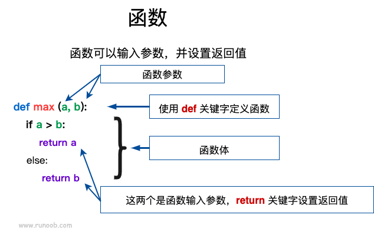
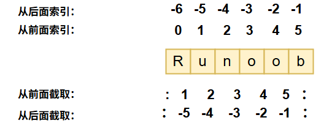
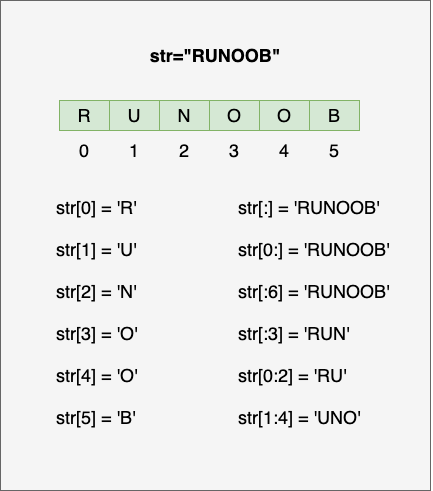
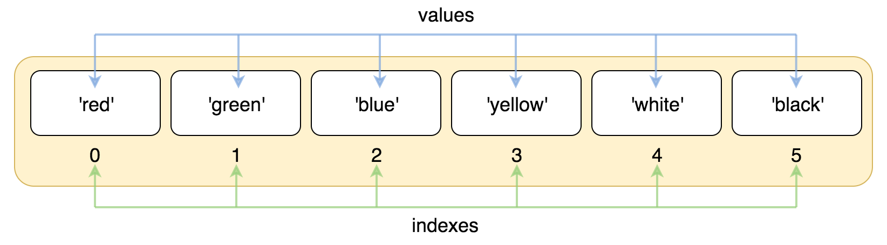
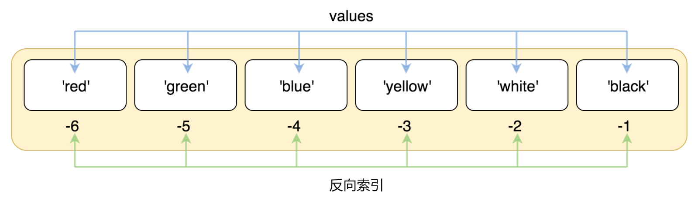
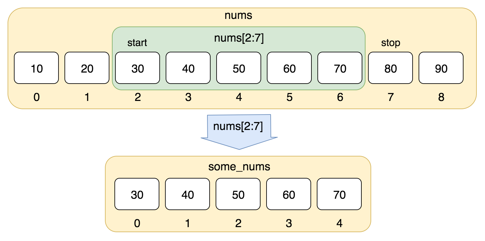
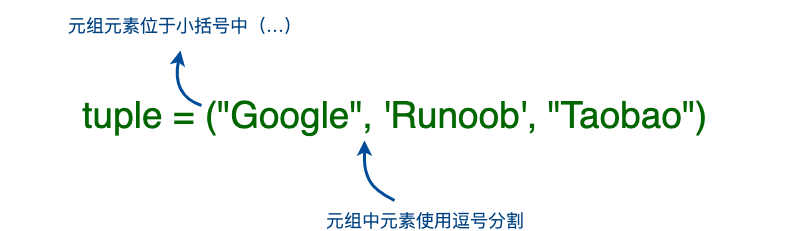
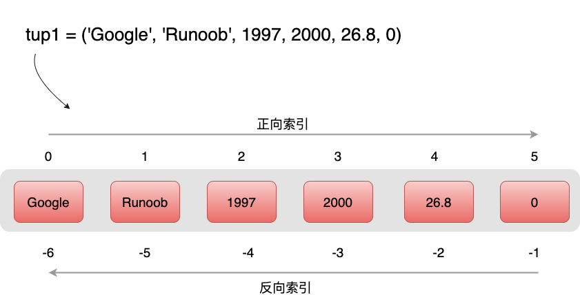
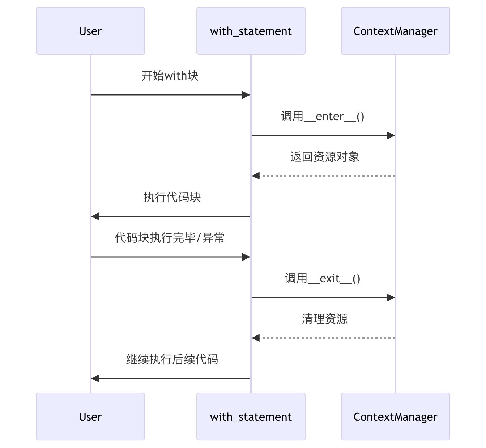

# 面向对象编程（Object-Oriented Programming，简称 OOP）
是一种**以"对象"为核心的编程范式**，它将数据和操作数据的方法组合成相互关联的对象，而不是传统的过程式编程中的一系列函数操作。OOP 是对现实世界建模的有效方式。

- 为什么使用 OOP？
1. **模块化**：分治复杂系统
2. **复用性**：通过继承减少重复代码
3. **扩展性**：易于添加新功能
4. **维护性**：修改局部不影响全局
5. **现实映射**：更符合人类思维方式

- 设计五大原则（SOLID）
1. **S** 单一职责原则（一个类只做一件事）
2. **O** 开闭原则（对扩展开放，对修改关闭）
3. **L** 里氏替换原则（子类可替代父类）
4. **I** 接口隔离原则（多个专用接口优于单一通用接口）
5. **D** 依赖倒置原则（依赖抽象而非具体实现）

掌握 OOP 需要实践：尝试将现实中的概念建模为类（如用户系统：`User`、`Admin` 类；电商系统：`Product`、`Order`、`Payment` 类等）。这种编程范式能让你构建更灵活、可维护的大型应用系统。


## 四大核心概念

### 1. 类和对象（Class & Object）
- **类（Class）**：对象的蓝图或模板
  - 定义一组对象的公共属性和方法
  - 例如 `Car` 类描述所有汽车的共同特征
- **对象（Object）**：类的具体实例
  - 基于类创建的具体实体
  - 例如 `myTesla = Car()` 创建一个具体的汽车对象

### 2. 封装（Encapsulation）
- **隐藏实现细节**，只暴露必要接口
- 将数据和操作数据的方法捆绑在一起
- 访问控制：
  ```python
  class BankAccount:
      def __init__(self):
          self.__balance = 0  # 私有属性（双下划线）
      
      def deposit(self, amount):  # 公有方法
          self.__balance += amount
      
      def get_balance(self):  # 受控访问
          return self.__balance
  ```

### 3. 继承（Inheritance）
- 子类**继承父类的属性和方法**
- 实现代码重用和层次化扩展
- 示例：
  ```python
  class Animal:  # 父类
      def speak(self):
          pass

  class Dog(Animal):  # 子类继承
      def speak(self):  # 方法重写
          return "汪汪！"
  ```

### 4. 多态（Polymorphism）
- **同一接口在不同对象上有不同实现**
- 提高代码灵活性
- 示例：
  ```python
  def animal_sound(animal):
      print(animal.speak())  # 同一方法，不同结果
  
  animal_sound(Dog())   # 输出"汪汪！"
  animal_sound(Cat())   # 输出"喵喵！"
  ```

### 完整示例：汽车系统
```python
# 父类
class Vehicle:
    def __init__(self, brand, color):
        self.brand = brand
        self.color = color
        self.speed = 0
    
    def accelerate(self):
        self.speed += 10
        print(f"加速至 {self.speed} km/h")
    
    def __str__(self):  # 封装内部表示
        return f"{self.color} {self.brand}"

# 子类继承
class ElectricCar(Vehicle):
    def __init__(self, brand, color, battery_capacity):
        super().__init__(brand, color)  # 调用父类构造器
        self.battery = battery_capacity
    
    # 多态实现
    def accelerate(self):  
        self.speed += 20  # 电动车加速更快
        print(f"电动机平稳加速至 {self.speed} km/h")
        self.battery -= 1

# 使用对象
my_car = ElectricCar("Tesla", "红色", 100)
print(my_car)  # 输出: 红色 Tesla
my_car.accelerate()  # 输出: 电动机平稳加速至 20 km/h
```


## OOP vs 面向过程编程
| 特性 | OOP | 面向过程 |
|------|-----|---------|
| 核心单元 | 对象 | 函数 |
| 数据存储 | 对象内部 | 变量/数据结构 |
| 程序设计 | 自底向上 | 自顶向下 |
| 复用方式 | 继承/多态 | 函数复用 |
| 典型用例 | GUI、游戏、复杂系统 | 脚本、算法 |


# `def`定义函数

`def` 是 Python 中的**关键字**，意思是**定义一个函数**。它是英语单词 "define" 的缩写，中文可以理解为"定义"或"创建一个"。
```python
# 创建函数
def 函数名(参数):  # 👈 参数是可选的
    """函数的说明文档（可选）"""  
    函数要执行的代码...    # 👈 记住要缩进！
    return 结果       # 👈 返回结果也是可选的

# 使用函数
结果 = 函数名(传入的参数)
```



## 实际例子：计算矩形面积
```python
def calculate_area(length, width):  # 定义函数
    """计算矩形面积""" 
    area = length * width
    return area  # 返回结果

# 使用函数（不用重复写计算公式）
room1 = calculate_area(5, 4)  # 计算房间面积
book = calculate_area(15, 10)  # 计算书本面积

print(f"房间面积: {room1} 平方米")  
print(f"书本面积: {book} 平方厘米")
```
**运行结果：**
```
房间面积: 20 平方米
书本面积: 150 平方厘米
```


```python
def calculate_area(length, width):  # 定义函数
    """计算矩形面积""" 
    area = length * width
    return area  # 返回结果————用return返回结果，那么最后输出时候需要用print函数来显示
def calculate_perimeter(length, width):
    """计算矩形周长"""
    perimeter = 2 * (length + width)
    print(perimeter)  # 返回结果————用print函数直接输出结果

# 使用函数（不用重复写计算公式）
roomarea = calculate_area(5, 4)  #会return“20”，但不会打印出来
# 注意：calculate_area函数返回值是20，所以需要用print函数来显示
print(f"房间面积: {roomarea} 平方米")  #输出结果：房间面积: 20 平方米

roomperimeter=calculate_perimeter(5, 4)  #输出结果：18
print(f"房间周长: {roomperimeter} 米") #输出结果：房间周长: None 米
# 注意：calculate_perimeter函数直接用print输出结果，所以返回值是None
```

    房间面积: 20 平方米
    18
    房间周长: None 米
    

## `print`与`return`两种设计方式的对比
**结论：最好还是用`return`，后续调用会更灵活**

| 特性 | 内部print | return字符串 |
|------|------------------------|--------------------------|
| **函数职责** | 混合：判断+直接输出 | 单一：只判断返回描述 |
| **返回值** | 隐式返回None | 返回有意义字符串 |
| **可重用性** | ❌ 只能用于控制台打印 | ✅ 可用于GUI、日志等多种场景 |
| **灵活性** | ❌ 输出格式固定 | ✅ 调用方决定输出格式 |
| **测试难度** | ❌ 难以测试输出结果 | ✅ 容易验证返回值 |
| **程序结构** | ❌ 紧密耦合 | ✅ 松散耦合 |


## 新手常犯错误及解决

| 错误类型 | 错误代码示例 | 解决方法 |
|----------|--------------|----------|
| 忘记冒号 | `def my_function()` ❌ | `def my_function():` ✔️ |
| 忘记缩进 | <pre>def test():<br>print("错误") ❌</pre> | 加缩进：`print("正确")` ✔️ |
| 忘记调用函数 | `def hello(): ...` 写完不调用 | 使用 `hello()` 调用函数 |
| 参数不匹配 | `calculate_area(5)` ❌ | 传足够的参数 `calculate_area(5,3)` ✔️ |


## 总结：`def` 的核心作用
1. 创建可重复使用的代码块
2. 给你的代码块起个名字（函数名）
3. 可以接受输入（参数）
4. 可以返回结果（使用 `return`）
5. 让代码整洁，易于理解和维护

## 参数传递机制
### 对象类型影响
| 对象类型 | 传递方式 | 函数内修改影响 |
|----------|----------|----------------|
| 不可变对象<br>(数字/字符串/元组) | 值传递 | 不影响原始对象 |
| 可变对象<br>(列表/字典) | 引用传递 | 修改原始对象 |


```python
### 示例对比

# 不可变对象示例
def modify_num(n):
    n += 10
    return n

num = 5
modify_num(num)
print(modify_num(num))#  # 输出: 15（已改变）

# 注意：num的值仍然是5，因为整数是不可变对象，modify_num函数返回了一个新的值。
print(num)  # 输出: 5（未改变）


# 可变对象示例
def modify_list(lst):
    lst.append(99)
    return lst

my_list = [1, 2]
modify_list(my_list)
print(modify_list(my_list))  # 输出: [1, 2, 99]（已改变）

# 注意：my_list的值已被改变，因为列表是可变对象。   
print(my_list)  # 输出: [1, 2, 99]（已改变）


```

    15
    5
    [1, 2, 99, 99]
    [1, 2, 99, 99]
    


## 参数类型详解
### 必需参数
- 必须按顺序传入
- 数量必须匹配
```python
def greet(name):
    print(f"Hello, {name}")

greet("Alice")  # 正确
# greet()  ❌ 缺少参数报错
```

### 关键字参数
- 按参数名指定值
- 顺序无关
```python
def user_info(name, age):
    print(f"{name} is {age} years old")

user_info(age=30, name="Bob")  # 输出: Bob is 30 years old
```

### 默认参数
- 调用时可省略
- 必须声明在非默认参数后
```python
def printinfo( name, age = 35 ):
   "打印任何传入的字符串"
   print ("名字: ", name)
   print ("年龄: ", age)
   return
 
#调用printinfo函数
printinfo( age=50, name="runoob" )
print ("------------------------")
printinfo( name="runoob" )#未指定`age`,所以使用默认参数`35`


# 输出结果:
# 名字:  runoob
# 年龄:  50
# ------------------------
# 名字:  runoob
# 年龄:  35
```


### 不定长参数
一个函数能处理比当初声明时更多的参数。这些参数叫做不定长参数，和上述 2 种参数不同，声明时不会命名。基本语法如下：
```python
def functionname([formal_args,] *var_args_tuple ):
   "函数_文档字符串"
   function_suite
   return [expression]
```
- 加了星号 `*` 的参数会以`元组(tuple)`的形式导入，存放所有未命名的变量参数
- 加了两个星号` ** `的参数会以`字典(dict)`的形式导入
- 如果在函数调用时没有指定参数，它就是一个空元组/字典,以'()'/'{}'显示。


#### `*`元组(tuple)不定长参数
```python
def functionname([formal_args,] *var_args_tuple ):
   "函数_文档字符串"
   function_suite
   return [expression]
```


```python
#加了星号 `*` 的参数会以`元组(tuple)`的形式导入，存放所有未命名的变量参数
def print_args(*args):
        print(args)

print_args(1, 'a', True)  # 输出: (1, 'a', True)
print_args() # 输出: ()  # 没有传入参数时，输出空元组

  
#可以和固定参数组合
def printinfo(arg1, *vartuple):
    "打印任何传入的参数"
    print(arg1)
    print(vartuple)
    print(f"{arg1} ({', '.join(map(str, vartuple))})")  # 使用f-string格式化输出  

# 调用printinfo 函数
printinfo(70, 60, 50)  # 输出: 70 (60, 50)
printinfo(10)          # 输出: 10 ()
printinfo("runoob", 1, 2, 3, 4, 5)  # 输出: runoob (1, 2, 3, 4, 5)
```

    (1, 'a', True)
    ()
    70
    (60, 50)
    70 (60, 50)
    10
    ()
    10 ()
    runoob
    (1, 2, 3, 4, 5)
    runoob (1, 2, 3, 4, 5)
    


#### `**`字典(dict)不定长参数
```python
def functionname([formal_args,] **var_args_dict ):
   "函数_文档字符串"
   function_suite
   return [expression]
```


```python
#!/usr/bin/python3
  
# 可写函数说明
def printinfo( arg1, **vardict ):
   "打印任何传入的参数"
   print (arg1)
   print (vardict)
 
# 调用printinfo 函数
printinfo(1, a=2,b=3,c=3,f=4,g='shjh')
printinfo(1)
```

    1
    {'a': 2, 'b': 3, 'c': 3, 'f': 4, 'g': 'shjh'}
    1
    {}
    

### 不定长参数组合顺序
1. 必需参数
2. 默认参数
3. *元祖tuple
4. **字典dict

注意：默认参数只有在最末尾，省略才有意义。因为默认参数虽然有默认值，但输入设定参数时如果跳过，后续的参数会错位。


```python
def complex_func(a, b=2, *args, **kwargs):
    print(f"{a}, {b}, {args}, {kwargs}")

complex_func(1,3,4,5, name="John")#虽然b有默认值，但输入设定参数时无法跳过，必须指定数值，不然后续的参数会错位。即，默认参数只有在最末尾，省略才有意义
complex_func(1)  # 输出: 1, 2, (), {}  
# b使用默认值2，args和kwargs为空
```

    1, 3, (4, 5), {'name': 'John'}
    1, 2, (), {}
    


### 强制位置参数(Python 3.8+)
- 函数参数列表中的` /` 表示在它之前的参数（a, b）只能通过**位置传递**，不能用关键字传递；
- `*` 表示在它之后的参数（e, f）只能通过**关键字传递**，不能用位置传递。
- 中间的参数（c, d）既可以用位置，也可以用关键字传递。
- 例如，调用 f(1, 2, 3, 4, e=5, f=6) 是合法的，但 f(a=1, b=2, 3, 4, e=5, f=6) 会报错，因为 a 和 b 不能用关键字传递。
- 这样的写法可以让函数调用时参数的传递方式更加明确，减少调用时的歧义。这个特性常用于需要严格区分参数传递方式的场景


```python

def f(a, b, /, c, d, *, e, f):
    print(a, b, c, d, e, f)

# 正确调用
f(10, 20, 30, d=40, e=50, f=60)

# 错误示例
# f(10, b=20, c=30, d=40, e=50, f=60)  ❌ b不能关键字
# f(10, 20, 30, 40, 50, f=60)        ❌ e必须关键字


```

    10 20 30 40 50 60
    


## 返回值控制
### return 语句
- 结束函数执行
- 返回指定值
- 无return时返回None

```python
def calculator(a, b):
    return {
        "sum": a+b,
        "product": a*b
    }

result = calculator(3, 4)
print(result)  # 输出: {'sum':7, 'product':12}
```


### 只有return没有print
调用函数的时候需要用`print`来控制输出显示


```python
#!/usr/bin/python3
 
# 可写函数说明
def sum( arg1, arg2 ):
   # 返回2个参数的和."
   total = arg1 + arg2
#    print ("函数内置打印 : ", total)
   return total
 
# 调用sum函数
sum(1, 2)            #没有print输出，所以不会显示结果
print('——以上第一行调用\n')

aaa=sum(3, 4)        #没有print输出，所以不会显示结果
print('——以上第二行调用\n')

print('调用函数打印：',aaa)           #与第二行调用结合使用，定义aaa变量来接收函数返回值，并打印出来
print('——以上第三行调用\n')

print('调用函数打印：',sum(5, 6))     #不定义变量来接收函数返回值，直接打印函数调用结果
print('——以上第四行调用\n')


'''输出结果如下
——以上第一行调用

——以上第二行调用

调用函数打印： 7
——以上第三行调用

调用函数打印： 11
——以上第四行调用
'''
```

    ——以上第一行调用
    
    ——以上第二行调用
    
    调用函数打印： 7
    ——以上第三行调用
    
    调用函数打印： 11
    ——以上第四行调用
    
    


    '输出结果如下\n——以上第一行调用\n\n——以上第二行调用\n\n调用函数打印： 7\n——以上第三行调用\n\n调用函数打印： 11\n——以上第四行调用\n'


### 只有print没有return
因为没有return，所以只能直接调用函数，任何对函数进行的二次加工（如print），都会返回none


```python
#!/usr/bin/python3
 
# 可写函数说明
def sum( arg1, arg2 ):
   # 返回2个参数的和."
   total = arg1 + arg2
   print ("函数内置打印 : ", total)
#    return total
 
# 调用sum函数
sum(1, 2)            #函数已经有print命令，所以调用不需要print也会显示结果
print('——以上第一行调用\n')

aaa=sum(3, 4)        #函数已经有print命令，所以调用不需要print也会显示结果（是否额外定义变量无所谓,因为生效的是'sum(x,y)'这个直接调用的函数）
print('——以上第二行调用\n')

print('调用函数打印：',aaa)           #因为没有return，所以与第二行结合使用下，aaa是None，打印出来是None
print('——以上第三行调用\n')

print('调用函数打印：',sum(5, 6))      #生效的是'sum(x,y)'这个直接调用的函数，会引发函数内置的print命令。二次调用的print会返回none
print('——以上第四行调用\n')

'''输出结果如下
函数内置打印 :  3
——以上第一行调用     

函数内置打印 :  7
——以上第二行调用

调用函数打印： None
——以上第三行调用

函数内置打印 :  11
调用函数打印： None
——以上第四行调用  
'''
```

    函数内置打印 :  3
    ——以上第一行调用
    
    函数内置打印 :  7
    ——以上第二行调用
    
    调用函数打印： None
    ——以上第三行调用
    
    函数内置打印 :  11
    调用函数打印： None
    ——以上第四行调用
    
    


    '输出结果如下\n函数内置打印 :  3\n——以上第一行调用     \n\n函数内置打印 :  7\n——以上第二行调用\n\n调用函数打印： None\n——以上第三行调用\n\n函数内置打印 :  11\n调用函数打印： None\n——以上第四行调用  \n'


### 同时有print和return
直接调用函数，或对函数进行的二次加工（如print），都会正确返回


```python
#!/usr/bin/python3
 
# 可写函数说明
def sum( arg1, arg2 ):
   # 返回2个参数的和."
   total = arg1 + arg2
   print ("函数内置打印 : ", total)
   return total
 
# 调用sum函数
sum(1, 2)            #函数已经有print命令，所以调用不需要print也会显示结果
print('——以上第一行调用\n')

aaa=sum(3, 4)        #函数已经有print命令，所以调用不需要print也会显示结果（是否额外定义变量无所谓）
print('——以上第二行调用\n')

print('调用函数打印：',aaa)           #与第二行调用结合使用，定义aaa变量来接收函数返回值，并打印出来
print('——以上第三行调用\n')


print('调用函数打印：',sum(5, 6))     #不定义变量来接收函数返回值，直接打印函数调用结果。会同时触发return和print命令
print('——以上第四行调用\n')


'''输出结果如下
函数内置打印 :  3
——以上第一行调用

函数内置打印 :  7
——以上第二行调用

调用函数打印： 7
——以上第三行调用

函数内置打印 :  11
调用函数打印： 11 
——以上第四行调用
'''
```

    函数内置打印 :  3
    ——以上第一行调用
    
    函数内置打印 :  7
    ——以上第二行调用
    
    调用函数打印： 7
    ——以上第三行调用
    
    函数内置打印 :  11
    调用函数打印： 11
    ——以上第四行调用
    
    


    '输出结果如下\n函数内置打印 :  3\n——以上第一行调用\n\n函数内置打印 :  7\n——以上第二行调用\n\n调用函数打印： 7\n——以上第三行调用\n\n函数内置打印 :  11\n调用函数打印： 11 \n——以上第四行调用\n'


## 文档与注释
### 最佳实践
```python
def calculate_area(width, height):
    """
    计算矩形面积
    
    参数:
    width (float): 宽度
    height (float): 高度
    
    返回:
    float: 矩形面积
    """
    return width * height

# 查看文档
print(calculate_area.__doc__)
```


## 函数高级应用
### 嵌套函数
```python
def outer():
    print("外部函数")
    
    def inner():
        print("内部函数")
    
    return inner

inner_func = outer()  # 输出: 外部函数
inner_func()          # 输出: 内部函数
```

### 闭包应用
```python
def multiplier(factor):
    def multiply(x):
        return x * factor
    return multiply

double = multiplier(2)
print(double(5))  # 输出: 10
```


## 函数设计原则
1. **单一职责**：每个函数只做一件事
2. **合理命名**：使用动词描述功能
3. **参数控制**：限制参数数量（≤5个）
4. **避免副作用**：除非必要不修改外部状态
5. **明确返回值**：保持返回类型一致性
```python
# 良好设计示例
def process_data(data, method='mean'):
    """处理数据集"""
    if method == 'mean':
        return sum(data) / len(data)
    elif method == 'sum':
        return sum(data)
    else:
        raise ValueError("无效方法")
```

# input()
在 Python 中，`input()` 是一个内置函数，用于从用户获取**字符串形式的输入**。它会暂停程序执行，等待用户在命令行（终端）中输入内容，按回车键确认后返回输入的字符串。
## 基础用法
```python
user_input = input("提示信息: ")  # 提示信息可选
```
- **返回值**: 总是返回字符串 (`str` 类型)
- **参数**: 可选的字符串参数，用作输入提示（如 `"请输入姓名："`）
    ```python
    name = input("请输入你的名字: ")
    print(f"你好，{name}!")
    # 输入：Alice
    # 输出：你好，Alice!
    ```


```python
name = input("请输入你的名字: ")
print(f"你好，{name}!")
```

    你好，小明!
    


### 重要特性
1. **所有输入均为字符串**  
   即使输入数字，也会被当作字符串处理：
   ```python
   age = input("请输入年龄: ")
   print(type(age))  # 输出 <class 'str'>
   ```

2. **转换为其他类型需显式转换**  
   ```python
   # 转为整数
   num = int(input("请输入数字: "))
   
   # 转为浮点数
   price = float(input("请输入价格: "))
   ```

3. **输入多值需拆分**  
   ```python
   data = input("输入两个数 (用空格分隔): ")
   a, b = map(int, data.split())  # 拆分为列表并转为整数
   print(a + b)
   ```


### 常见问题与解决
| 问题 | 原因 | 解决方案 |
|------|------|----------|
| 输入数字报错 `ValueError` | 未转换字符串为数字 | 使用 `int()` 或 `float()` 转换 |
| 多值输入处理复杂 | 输入是单个字符串 | 用 `.split()` 拆分字符串 |
| 程序卡住无响应 | 等待 `input()` | 检查是否有未完成的输入请求 |
| EOFError (Ctrl+D) | 读到文件结束符 | 用 `try-except` 捕获异常 |


# print()
- Python 中单引号 ' 和双引号 " 使用完全相同。
- 使用三引号(''' 或 """)可以指定一个多行字符串。
- 转义符 \。
- 反斜杠可以用来转义，使用 r 可以让反斜杠不发生转义。 如r"this is a line with \n" 则 \n 会显示，并不是换行。
- 按字面意义级联字符串，如 "this " "is " "string" 会被自动转换为 this is string。
- 字符串可以用 + 运算符连接在一起，用 * 运算符重复。


```python
print("Hello, World!") #Python 中单引号 ' 和双引号 " 使用完全相同。
print("Hello 'World!'")#单引号内的双引号不需要转义
print('Hello "World!"')#双引号内的单引号不需要转义
print("Hello World!")#字符串中间的空格会被保留
```

    Hello, World!
    Hello 'World!'
    Hello "World!"
    Hello World!
    


```python
print("Hello" + "World!")#字符串连接
print("Hello " * 3)#字符串重复
```

    HelloWorld!
    Hello Hello Hello 
    


```python
print("Hello\nWorld!")#转义符 \n 用于换行
print("Hello\tWorld!")#转义符 \t 用于制表符,即空格(动态对齐至8的倍数)
print("Hello\\World!")#转义符 \\ 用于输出反斜杠     
print("Hello \"let's go!\"")#转义符 \ 用于转义字符,多个'和"时避免歧义错误
print(r"this is a line with \n") #r前缀表示原始字符串,不会处理转义字符,输出原样字符串
```

    Hello
    World!
    Hello	World!
    Hello\World!
    Hello "let's go!"
    this is a line with \n
    


```python
print('''jjdsfjk
      sdjg
      khsdkf
      ''')#使用三引号(''' 或 """)可以指定一个多行字符串,而不用每行都打\n 用于换行
```

    jjdsfjk
          sdjg
          khsdkf
          
    

# 变量
## 变量命名规则
- 由字母、数字和下划线组成，不能包含空格。（py3支持中文字符，不过慎用）
- 不能是数字打头。
- 禁止使用python关键字和函数名。
- 慎用字母l和o，因为和数字1和0傻傻分不清
- 标识符对大小写敏感，count 和 Count 是不同的标识符

## 数据类型
- 不可变数据    
  - Number（数字）
    - int（整数）
    - float（浮点）
    - bool（布尔类型） 
    - complex（复数）
  - String（字符串）
  - Tuple（元组）
- 可变数据
  - List（列表）
  - Set（集合）
  - Dictionary（字典）
- 其他 
  - 字节数组类型(bytes)  
  
   type() 函数可以用来查询变量所指的对象类型


```python
# 变量定义
x = 10          # 整数<class 'int'
y = 3.14         # 浮点数<class 'float'
name = "Alice"   # 字符串<class 'str'
is_active = True # 布尔值<class 'bool'首字母大写

# 多变量赋值
a, b, c = 1, 2, "three"

# 查看数据类型
print(type(x))        # <class 'int'
print(type(y))        # <class 'float'
print(type(name))     # <class 'str'
print(type(is_active)) # <class 'bool'

print(c,a)
```

    <class 'int'>
    <class 'float'>
    <class 'str'>
    <class 'bool'>
    three 1
    

# 对比：列表、元组、集合、字典

## 核心特性对比表

| **特性**        | **列表 (list)**       | **元组 (tuple)**      | **集合 (set)**         | **字典 (dict)**        |
|------------------|-----------------------|-----------------------|------------------------|------------------------|
| **可变性**       | ✅ 可变               | ❌ 不可变             | ✅ 可变                | ✅ 可变                |
| **有序性**       | ✅ 保持插入顺序       | ✅ 保持插入顺序       | ❌ 无序                | Python 3.7+ 有序      |
| **元素要求**     | 可重复                | 可重复                | ❌ 唯一性              | 键(key)唯一           |
| **语法标识**     | `[1, 2, 3]`          | `(1, 2, 3)`           | `{1, 2, 3}`           | `{'a':1, 'b':2}`      |
| **空对象创建**   | `[]` 或 `list()`      | `()` 或 `tuple()`     | `set()` (不能 `{}`)    | `{}` 或 `dict()`       |
| **索引访问**     | ✅ `lst[0]`          | ✅ `tup[0]`          | ❌ 不支持              | ✅ 按键访问 `d['key']` |
| **元素查找效率** | O(n) 线性查找        | O(n) 线性查找        | O(1) 常量时间         | O(1) 常量时间         |
| **添加元素**     | `append()`, `insert()` | ❌ 不支持             | `add()`               | `d[key] = value`      |
| **删除元素**     | `pop()`, `remove()`   | ❌ 不支持             | `remove()`, `discard()`| `pop()`, `del d[key]`  |
| **哈希性**       | ❌ 不可哈希           | ✅ 可哈希             | 元素必须可哈希        | 键必须可哈希           |
| **内存占用**     | 中等                  | 较小                 | 较大                  | 最大                  |
| **迭代速度**     | 快速                  | 快速                 | 快速                  | 相对慢               |
| **典型用途**     | 数据集合、序列处理    | 常量数据、函数返回值  | 去重、成员检测         | 键值映射、JSON数据     |

列表和元祖有点像，但因为部分特性不同，因此使用场景有明显区分。一般来说需要频繁变动的用list，内容较为固定的用tuple
- ​需要修改数据 → 使用列表​
- ​数据固定不变 → 使用元组​
- ​字典键需要 → 使用元组（键必须可哈希）​​
- ​内存敏感场景 → 优先元组​
- ​高性能访问 → 优先元组​
- ​需要丰富操作方法 → 使用列表


### 常用操作对比

#### 创建和初始化
```python
# 列表
lst = [1, 2, 3]
lst = list(range(5))

# 元组
tup = (1, 2, 3)
tup = tuple([1, 2, 3])

# 集合
s = {1, 2, 3}
s = set([1, 1, 2])  # {1, 2}

# 字典
d = {'a': 1, 'b': 2}
d = dict(a=1, b=2)
```

#### 元素访问
```python
# 列表/元组 - 索引访问
print(lst[0])  # 第一个元素

# 集合 - 无法索引，只能迭代/检测
if 1 in s:
    print("存在")

# 字典 - 按键访问
print(d['a'])  # 1
```

#### 添加元素
```python
# 列表
lst.append(4)         # 末尾添加
lst.insert(0, 0)       # 指定位置插入

# 元组 - ❌ 不能添加

# 集合
s.add(4)              # 添加单个元素
s.update([5, 6])      # 添加多个元素

# 字典
d['c'] = 3            # 添加键值对
d.update({'d': 4})    # 批量添加
```

#### 删除元素
```python
# 列表
lst.pop()       # 删除最后一个
lst.pop(0)      # 删除指定索引
lst.remove(2)   # 删除指定值

# 元组 - ❌ 不能删除

# 集合
s.remove(3)     # 删除指定元素（元素需存在）
s.discard(10)   # 安全删除（元素不在也不报错）

# 字典
del d['a']      # 删除键
d.pop('b')      # 删除并返回键值
```

#### 常用转换：
```python
# 列表 ↔ 元组
tuple([1, 2, 3])   # (1, 2, 3)
list((1, 2, 3))     # [1, 2, 3]

# 列表/元组 → 集合（去重）
set([1, 1, 2])     # {1, 2}

# 字典 → 列表
list({'a':1, 'b':2})      # ['a', 'b'] (键列表)
list({'a':1, 'b':2}.values()) # [1, 2] (值列表)
list({'a':1, 'b':2}.items())  # [('a', 1), ('b', 2)]
```


## 数据类型转换
| 函数 | 描述 |
|------|------|
| `int(x [,base])` | 将x转换为一个整数(`base`是进制参数，默认十进制可省略，如果要转为其他进制可直接指定数字，如`int(x,16)`) 
注意：`str`无法直接转为`int`，需要先转为`float`|
| `float(x)` | 将x转换到一个浮点数 |
| `complex(real [,imag])` | 创建一个复数 |
| `str(x)` | 将对象 x 转换为字符串 |
| `repr(x)` | 将对象 x 转换为表达式字符串 |
| `eval(str)` | 用来计算在字符串中的有效Python表达式，并返回一个对象 |
| `tuple(s)` | 将序列 s 转换为一个元组 |
| `list(s)` | 将序列 s 转换为一个列表 |
| `set(s)` | 转换为可变集合 |
| `dict(d)` | 创建一个字典。d 必须是一个 (key, value)元组序列 |
| `frozenset(s)` | 转换为不可变集合 |
| `chr(x)` | 将一个整数转换为一个字符 |
| `ord(x)` | 将一个字符转换为它的整数值 |
| `hex(x)` | 将一个整数转换为一个十六进制字符串 |
| `oct(x)` | 将一个整数转换为一个八进制字符串 |


```python
x = float(1)     # x 输出结果为 1.0
y = float(2.8)   # y 输出结果为 2.8
z = float("3")   # z 输出结果为 3.0
w = float("4.2") # w 输出结果为 4.2
```


```python
num_int = 123
num_str = "456"

print("num_int 数据类型为:",type(num_int))
print("类型转换前，num_str 数据类型为:",type(num_str))

num_str = int(num_str)    # 强制转换为整型
print("类型转换后，num_str 数据类型为:",type(num_str))

num_sum = num_int + num_str

print("num_int 与 num_str 相加结果为:",num_sum)
print("sum 数据类型为:",type(num_sum))
```

    num_int 数据类型为: <class 'int'>
    类型转换前，num_str 数据类型为: <class 'str'>
    类型转换后，num_str 数据类型为: <class 'int'>
    num_int 与 num_str 相加结果为: 579
    sum 数据类型为: <class 'int'>
    

# 运算符
Python 支持以下类型的运算符：
- 算术运算符
- 比较运算符
- 赋值运算符
- 位运算符
- 逻辑运算符
- 成员运算符
- 身份运算符


## 算术运算符
假设变量 `a = 10`, 变量 `b = 21`：

| 运算符 | 描述         | 实例                  |
|--------|--------------|-----------------------|
| `+`    | 加法         | `a + b = 31`         |
| `-`    | 减法         | `a - b = -11`        |
| `*`    | 乘法         | `a * b = 210`        |
| `/`    | 除法         | `b / a = 2.1`        |
| `%`    | 取模（余数） | `b % a = 1`         |
| `**`   | 幂运算       | `a**b = 10^21`       |
| `//`   | 取整除       | `9//2 = 4`, `-9//2 = -5` |

**示例代码**：

a = 21
b = 10
c = a + b  # 结果为 31
c = a - b  # 结果为 11
c = a * b  # 结果为 210
c = a / b  # 结果为 2.1
c = a % b  # 结果为 1
c = a ** b # 结果为 16679880978201
c = a // b # 结果为 2


---


## 比较运算符
假设变量 `a = 10`, 变量 `b = 20`： 

| 运算符 | 描述       | 实例                |
|--------|------------|---------------------|
| `==`   | 等于       | `(a == b) → False` |
| `!=`   | 不等于     | `(a != b) → True`   |
| `>`    | 大于       | `(a > b) → False`  |
| `<`    | 小于       | `(a < b) → True`   |
| `>=`   | 大于等于   | `(a >= b) → False` |
| `<=`   | 小于等于   | `(a <= b) → True`  |

**示例代码**：

a = 21
b = 10
if a == b: print("a 等于 b")
else: print("a 不等于 b")  # 输出 "a 不等于 b"

**注意：Python3 已不支持 <> 运算符，可以使用 != 代替**

---


## 赋值运算符

| 运算符 | 描述       | 实例               | 等价于         |
|--------|------------|--------------------|----------------|
| `=`    | 赋值       | `c = a + b`       | -              |
| `+=`   | 加法赋值   | `c += a`          | `c = c + a`    |
| `-=`   | 减法赋值   | `c -= a`          | `c = c - a`    |
| `*=`   | 乘法赋值   | `c *= a`          | `c = c * a`    |
| `/=`   | 除法赋值   | `c /= a`          | `c = c / a`    |
| `%=`   | 取模赋值   | `c %= a`          | `c = c % a`    |
| `**=`  | 幂赋值     | `c **= a`         | `c = c ** a`   |
| `//=`  | 取整除赋值 | `c //= a`         | `c = c // a`   |
| `:=`   | 海象运算符 | 在表达式中同时进行赋值和返回赋值的值。Python3.8 版本新增运算符。| if (n := len(a)) > 10:print(f"List is too long ({n} elements, expected <= 10)") |

**海象运算符示例**：

- 传统写法
n = 10
if n > 5: print(n)

- 使用海象运算符
if (n := 10) > 5: print(n)  # 输出 10


---


## 位运算符
假设变量 `a = 60` (二进制 `0011 1100`), `b = 13` (二进制 `0000 1101`):

| 运算符 | 描述       | 实例                | 二进制解释         |
|--------|------------|---------------------|--------------------|
| `&`    | 按位与     | `a & b = 12`       | `0000 1100`       |
| `|`    | 按位或     | `a | b = 61`       | `0011 1101`       |
| `^`    | 按位异或   | `a ^ b = 49`       | `0011 0001`       |
| `~`    | 按位取反   | `~a = -61`         | `1100 0011`       |
| `<<`   | 左移       | `a << 2 = 240`     | `1111 0000`       |
| `>>`   | 右移       | `a >> 2 = 15`      | `0000 1111`       |

**示例代码**：

a = 60  # 0011 1100
b = 13  # 0000 1101
print(a & b)  # 输出 12 (0000 1100)
print(a | b)  # 输出 61 (0011 1101)
print(a ^ b)  # 输出 49 (0011 0001)


---


## 逻辑运算符
假设变量 `a = 10`, `b = 20`：

| 运算符 | 逻辑表达式 | 描述                     | 实例                   |
|--------|------------|--------------------------|------------------------|
| `and`  | `x and y`  | 与（两者为真则返回y）    | `(a and b) → 20`      |
| `or`   | `x or y`   | 或（任一为真则返回x）    | `(a or b) → 10`       |
| `not`  | `not x`    | 非（反转布尔值）         | `not(a and b) → False` |

**真值表**：

print(0 and 1)   # → 0
print(False and 1) # → False
print(-1 and 1)  # → 1
print(1 or False) # → 1


---


## 成员运算符

| 运算符   | 描述                   | 实例                        |
|----------|------------------------|-----------------------------|
| `in`     | 存在于序列中返回 True  | `x in [1,2,3] → True`       |
| `not in` | 不存在于序列中返回 True | `x not in [1,2,3] → False` |

**示例**：

list = [1, 2, 3, 4, 5]
a = 3
print(a in list)     # 输出 True
print(10 not in list) # 输出 True


---


## 身份运算符

| 运算符    | 描述                     | 实例                     |
|-----------|--------------------------|--------------------------|
| `is`      | 引用同一对象返回 True    | `a is b`                |
| `is not`  | 引用不同对象返回 True    | `a is not b`             |

**与 `==` 的区别**：

a = [1,2,3]
b = a
print(b is a)    # → True (同一对象)
print(b == a)    # → True (值相等)

c = a[:]
print(c is a)    # → False (不同对象)
print(c == a)    # → True (值相等)


---


## 运算符优先级
从高到低优先级：

| 优先级 | 运算符                                      | 描述               |
|--------|---------------------------------------------|--------------------|
| 1      | `()` `[]` `{}` `.` `await x`                | 括号/属性引用      |
| 2      | `**`                                        | 幂运算             |
| 3      | `+x` `-x` `~x`                             | 一元运算符         |
| 4      | `*` `@` `/` `//` `%`                        | 乘除               |
| 5      | `+` `-`                                     | 加减               |
| 6      | `<<` `>>`                                   | 移位               |
| 7      | `&`                                         | 按位与             |
| 8      | `^`                                         | 按位异或           |
| 9      | `|`                                         | 按位或             |
| 10     | `in` `not in` `is` `is not` `<` `<=` `>` `>=` `!=` `==` | 比较运算 |
| 11     | `not`                                       | 逻辑非             |
| 12     | `and`                                       | 逻辑与             |
| 13     | `or`                                        | 逻辑或             |
| 14     | `if -- else`                                | 条件表达式         |
| 15     | `lambda`                                    | Lambda表达式       |
| 16     | `:=`                                        | 赋值表达式         |

**示例**：

a = 20
b = 10
c = (a + b) * c / d  # 括号具有最高优先级


# 字符串(string)
## 字符串截取
- Python 不支持单字符类型，单字符也是字符串
- 使用方括号 `[]` 和索引访问子字符串
- 索引从 0 开始，负索引从末尾开始

**语法**：`变量[起始索引:结束索引]`
- ***！！！(左闭右开)***
- 空格不计数
  




```python
#!/usr/bin/python3
 
var1 = 'Hello World!'
var2 = "Runoob"
 
print (var1[6])#空格不计数
print (var2[1:5])
```

    W
    unoo
    

## 字符串拼接
通过截取和拼接更新字符串


```python
#!/usr/bin/python3
 
var1 = 'Hello World!'
 
print ("已更新字符串 : ", var1[:6] + 'Runoob!')
```

    已更新字符串 :  Hello Runoob!
    


## 转义字符
| **转义符** | **类别**         | **功能**                     | **典型场景**                  |
|------------|------------------|------------------------------|-----------------------------|
| `\'`       | 语法冲突规避     | 以字符串形式输出特殊字符（如引号）         | 单引号字符串内包含单引号  |
| `\n`       | 文本格式控制     | 换行符             | 多行文本分隔        |
| `\t`       | 文本格式控制     | 插入水平制表符（对齐）       | 表格数据对齐            |
| `\b`       | 特殊控制功能     | 删除前一个字符               | 动态修改输出内容         |
| `\f`       | 特殊控制功能     | 分页符         | 打印机分页控制           |
| `\x41`     | 编码扩展机制     | 十六进制直接表示ASCII字符    | 特殊字符输入         |

**注**：  
- 转义符的核心逻辑是通过`\`改变后续字符的原始含义  
- 进制转换部分虽非转义符，但展示了数值的多种编码方式，帮助理解`\x41`等转义机制  
- 退格符`\b`在终端生效（IDE可能显示为`[]`符号）  
- 换页符`\f`的行为取决于输出设备（终端/打印机）


```python
# ===== 转义字符：规避语法冲突类 =====
print('\'Hello, world!\'')  # 转义符：\' → 在单引号字符串内输出单引号本身
                            # 作用：避免字符串被单引号提前终止 
                            # 输出：'Hello, world!'

# ===== 转义字符：控制文本格式类 =====
print("Hello, world!\nHow are you?")  # 转义符：\n → 插入换行符
                                      # 作用：将后续文本移动到新行首 
                                      # 输出：
                                      # Hello, world!
                                      # How are you?

print("Hello, world!\tHow are you?")  # 转义符：\t → 插入水平制表符
                                      # 作用：添加4-8空格宽度（对齐文本）
                                      # 输出：Hello, world!    How are you?

# ===== 转义字符：特殊控制功能类 =====
print("Hello,\b world!")   # 转义符：\b → 退格符（删除前一字符）
                            # 作用：删除逗号（光标左移覆盖）
                            # 输出：Hello world!

print("Hello,\f world!")    # 转义符：\f → 换页符
                            # 作用：垂直跳转到下个逻辑页首 
                            # 输出：
                            # Hello,
                            #  world!

# ===== 字符编码与进制转换 =====
print("A 对应的 ASCII 值为：", ord('A'))  # ord() → 获取字符的十进制ASCII值
                                        # 输出：A 对应的 ASCII 值为：65

print("\x41 为 A 的 ASCII 代码")  # 转义符：\x41 → 十六进制编码
                                # 作用：直接表示ASCII字符（41 hex = 65 dec = 'A'）
                                # 输出：A 为 A 的 ASCII 代码
print("\u0041 为 A 的 Unicode 代码")  # 转义符：\u0041 → Unicode编码
                                        # 作用：表示Unicode字符（0041 hex = 'A'）
                                        # 输出：A 为 A 的 Unicode 代码
```

    'Hello, world!'
    Hello, world!
    How are you?
    Hello, world!	How are you?
    Hello world!
    Hello, world!
    A 对应的 ASCII 值为： 65
    A 为 A 的 ASCII 代码
    A 为 A 的 Unicode 代码
    


## 字符串运算符
假设 `a = "Hello"`, `b = "Python"`：

| 运算符 | 描述         | 示例                    | 结果             |
|--------|--------------|-------------------------|------------------|
| `+`    | 连接字符串   | `a + b`                | `HelloPython`   |
| `*`    | 重复输出     | `a * 2`                | `HelloHello`    |
| `[]`   | 索引访问     | `a[1]`                 | `e`             |
| `[:]`  | 切片访问     | `a[1:4]`               | `ell`           |
| `in`   | 成员判断     | `'H' in a`             | `True`          |
| `not in` | 非成员判断 | `'M' not in a`         | `True`          |
| `r/R`  | 原始字符串   | `print(r'\n')`         | `\n`            |
| `%`    | 格式化       | `"Name: %s" % 'John'`  | `Name: John`    |


```python
#!/usr/bin/python3
 
a = "Hello"
b = "Python"
 
print("a + b 输出结果：", a + b)
print("a * 2 输出结果：", a * 2)
print("a[1] 输出结果：", a[1])
print("a[1:4] 输出结果：", a[1:4])
 
if( "H" in a) :
    print("H 在变量 a 中")
else :
    print("H 不在变量 a 中")
 
if( "M" not in a) :
    print("M 不在变量 a 中")
else :
    print("M 在变量 a 中")
 
print (r'\n')
print (R'\n')
```

    a + b 输出结果： HelloPython
    a * 2 输出结果： HelloHello
    a[1] 输出结果： e
    a[1:4] 输出结果： ell
    H 在变量 a 中
    M 不在变量 a 中
    \n
    \n
    

## 字符串格式化

### 1. % 格式化
#### 格式化符号
- `%s`格式化字符串
- `%d`格式化整数
- `%f`格式化浮点数字，可指定小数点后的精度
- `%e`用科学计数法格式化浮点数
- `%E`作用同%e，用科学计数法格式化浮点数
- `%g`%f和%e的简写
- `%G`%f 和 %E 的简写
- `%u`格式化无符号整型
- `%o`格式化无符号八进制数
- `%x`格式化无符号十六进制数
- `%X`格式化无符号十六进制数（大写）
- `%p`用十六进制数格式化变量的地址
- `%c`格式化字符及其ASCII码
#### 格式化操作符辅助指令
- `*`定义宽度或者小数点精度
- `-`用做左对齐
- `+`在正数前面显示加号( + )
- `<sp>`在正数前面显示空格
- `#`在八进制数前面显示零('0')，在十六进制前面显示'0x'或者'0X'(取决于用的是'x'还是'X')
- `0`显示的数字前面填充'0'而不是默认的空格
- `%`'%%'输出一个单一的'%'
- `(var)`映射变量(字典参数)
- `m.n.`m 是显示的最小总宽度,n 是小数点后的位数(如果可用的话)


```python
print("我叫 %s 今年 %d 岁!" % ('小明', 10)) 
#  `%s` 是字符串占位符，`%d` 是整数占位符。后面的 `('小明', 10)` 是一个元组，分别对应前面格式字符串中的两个占位符。执行时，`%s` 会被 `'小明'` 替换，`%d` 会被 `10` 替换，最终生成的字符串是 `"我叫 小明 今年 10 岁!"`。
# 这种格式化方式在 Python2 和 Python3 中都支持，但在 Python3 中推荐使用 `str.format()` 或 f-string（如 `f"我叫 {name} 今年 {age} 岁!"`）进行格式化。不过 `%` 格式化依然常见，尤其是在处理简单的输出时。

num=float(input())
# print("{:.2f}".format(num))
# print(f'{num:.2f}')
print('%.2f'%num)# 输出保留两位小数

```

    我叫 小明 今年 10 岁!
    


    ---------------------------------------------------------------------------

    ValueError                                Traceback (most recent call last)

    Cell In[22], line 5
          1 print("我叫 %s 今年 %d 岁!" % ('小明', 10)) 
          2 #  `%s` 是字符串占位符，`%d` 是整数占位符。后面的 `('小明', 10)` 是一个元组，分别对应前面格式字符串中的两个占位符。执行时，`%s` 会被 `'小明'` 替换，`%d` 会被 `10` 替换，最终生成的字符串是 `"我叫 小明 今年 10 岁!"`。
          3 # 这种格式化方式在 Python2 和 Python3 中都支持，但在 Python3 中推荐使用 `str.format()` 或 f-string（如 `f"我叫 {name} 今年 {age} 岁!"`）进行格式化。不过 `%` 格式化依然常见，尤其是在处理简单的输出时。
    ----> 5 num=float(input())
          6 # print("{:.2f}".format(num))
          7 # print(f'{num:.2f}')
          8 print('%.2f'%num)# 输出保留两位小数
    

    ValueError: could not convert string to float: ''


### 数字格式化规则

**数值精度控制规则**
| **语法**    | **功能**                | **示例**         | **输出**    |
|-------------|------------------------|------------------|-------------|
| `{:.nf}`    | 保留 `n` 位小数（四舍五入） | `{:.2f}` → `3.1415926` | `3.14`      |
| `{:.0f}`    | 舍去小数（整数输出）      | `{:.0f}` → `2.71828`   | `3`         |
| `{:+.nf}`   | 强制显示正负号           | `{:+.2f}` → `3.1415926`| `+3.14`     |
| `{:-.nf}`   | 负数显符号，正数不显`+`   | `{:-.2f}` → `-1`       | `-1.00`     |

**数字填充与对齐规则**
| **语法**      | **功能**                     | **示例**          | **输出**    |
|---------------|-----------------------------|-------------------|-------------|
| `{:c>nd}`     | **左侧补字符** `c`（宽度 `n`） | `{:0>2d}` → `5`   | `05`        |
| `{:c<nd}`     | **右侧补字符** `c`（宽度 `n`） | `{:x<4d}` → `5`   | `5xxx`      |
| `{:>nd}`      | 右对齐（空格填充，宽度 `n`）   | `{:>10d}` → `13`  | `•••••••13` |
| `{:<nd}`      | 左对齐（空格填充，宽度 `n`）   | `{:<10d}` → `13`  | `13•••••••` |
| `{:^nd}`      | 居中对齐（空格填充，宽度 `n`） | `{:^10d}` → `13`  | `•••13••••` |

**注**：  
> - `c` 可为任意字符（如 `0`, `x`, 空格）；  
> - `n` 为总宽度，不足时填充，超出则原样输出。

**特殊格式转换规则**
| **语法**    | **功能**                  | **示例**            | **输出**       |
|-------------|--------------------------|---------------------|----------------|
| `{:,}`      | 千位分隔符                | `{:,}` → `1000000`  | `1,000,000`    |
| `{:.n%}`    | 百分比格式（保留 `n` 位小数）| `{:.2%}` → `0.25`  | `25.00%`       |
| `{:.ne}`    | 科学计数法（保留 `n` 位小数）| `{:.2e}` → `1e9`   | `1.00e+09`     |

**进制与类型转换规则**
| **语法**   | **功能**            | **示例**       | **输出** |
|------------|---------------------|----------------|----------|
| `{:b}`     | 十进制 → 二进制      | `'{:b}'.format(11)` | `1011`   |
| `{:o}`     | 十进制 → 八进制      | `'{:o}'.format(11)` | `13`     |
| `{:x}`     | 十进制 → 十六进制小写 | `'{:x}'.format(11)` | `b`      |
| `{:#x}`    | 带 `0x` 前缀的十六进制| `{:#x}` → `11`   | `0xb`    |
| `{:#X}`    | 带 `0X` 前缀的十六进制| `{:#X}` → `11`   | `0XB`    |

**规则总结与关键点**
| **类别**       | **核心符号** | **作用**                     |
|----------------|-------------|------------------------------|
| 精度控制       | `.n` `+` `-` | 小数位管理、符号显示         |
| 填充对齐       | `>` `<` `^` `c` | 宽度控制、文本定位         |
| 格式转换       | `,` `%` `e` | 数值可视化优化               |
| 进制转换       | `b` `o` `x` | 多进制输出支持               |

 **注意事项**：  
> 1. **符号冲突**：`+` 强制显示正号，`-` 仅显示负号（默认行为）；  
> 2. **对齐优先级**：填充字符 `c` 与对齐符需同时声明（如 `{:0>2d}`）；  
> 3. **科学计数法**：`e` 格式固定为小写指数符号（`e+09`），大写需手动转换；  
> 4. **宽度不足**：若数字位数超过宽度 `n`（如 `{:>2d}` → `100`），按原值输出。


### 2. `str.format`函数
基本语法是通过 `{} `和 `:` 来代替以前的 `% `。
format 函数可以接受不限个参数，位置可以不按顺序
- 第一行 `print("{} {}".format("Hello", "World"))` 展示了最基本的用法。花括号 `{} `是占位符，`format() `方法会将**传入的参数依次填充到这些占位符中**，输出结果为` Hello World`。

- 第二行 `print("{0} {1}".format("Hello", "World"))` 使用了位置索引。`{0} `和 `{1} `分别代表` format() `方法中第一个和第二个参数，因此输出结果同样是 `Hello World`。这种写法**在需要多次引用同一个参数时很有用**。

- 第三行 `print("{name} {age}".format(name="John", age=25))` 展示了关键字参数的用法。占位符 `{name} `和 `{age}` 会被 `format() `方法中对应的关键字参数替换，输出结果为 `John 25`。这种方式**使格式化字符串更加直观和易读**。


```python
print("{} {}".format("Hello", "World"))  # 基本用法
print("{0} {1} {1}".format("Hello", "World")) # 位置索引
print("{name} {age}".format(name="John", age=25)) # 关键字参数

# 通过字典设置参数
site = {"name": "菜鸟教程", "url": "www.runoob.com"}
print("网站名：{name}, 地址 {url}".format(**site))
 
# 通过列表索引设置参数
my_list = ['菜鸟教程', 'www.runoob.com']
print("网站名：{0[0]}, 地址 {0[1]}".format(my_list))  # "0" 是必须的
```


### 3. `f-string`函数
只需在字符串前加上字母 `f `或 `F`，然后在字符串内部用花括号 `{} `包裹变量或表达式，Python 会自动将其替换为对应的值


```python
name = "Runoob"
print(f"Hello {name}")  # 输出 Hello Runoob
print(f"{1+2}")         # 输出 3

x = 1
print(f"{x+1=}")       # 输出 x+1=2

num=float(input())
# print("{:.2f}".format(num))
print(f'{num:.2f}')# 输出保留两位小数

```

## 三引号
用于创建多行字符串.程序员从引号和特殊字符串的泥潭里面解脱出来，自始至终保持一小块字符串的格式是所谓的WYSIWYG（所见即所得）格式的


```python

para_str = """这是一个多行字符串的实例
多行字符串可以使用制表符TAB(\t)。
也可以使用换行符[\n]。"""

print(para_str)

```


```python
#HTML/SQL 应用示例

errHTML = '''
<HTML><HEAD><TITLE>Error</TITLE></HEAD>
<BODY><H3>ERROR</H3>
<B>%s</B></BODY></HTML>
'''
sql = '''
CREATE TABLE users (
login VARCHAR(8),
uid INTEGER,
prid INTEGER)
'''
print(errHTML)  # 输出错误信息的HTML格式
print(sql)  # 输出SQL创建表的语句
```

## 字符串内建函数

| 函数 | 描述 | 示例 |
|------|------|------|
| `capitalize()` | 字符串第一个字母大写 | `"hello".capitalize()` → `"Hello"` |
| `center(width, fillchar)` | 居中填充 | `"hello".center(10, '*')` → `**hello***` |
| `count(sub, start, end)` | 出现次数 | `"hello".count('l')` → `2` |
| `encode(encoding='UTF-8')` | 编码 | `"你好".encode()` → `b'\xe4\xbd\xa0\xe5\xa5\xbd'` |
| `endswith(suffix)` | 结尾判断 | `"hello".endswith('o')` → `True` |
| `find(sub, start, end)` | 查找子串 | `"hello".find('ll')` → `2` |
| `index(sub)` | 查找子串 | 类似 `find()`，但未找到时报错 |
| `isalnum()` | 字母或数字 | `"abc123".isalnum()` → `True` |
| `isalpha()` | 字母 | `"abc".isalpha()` → `True` |
| `isdigit()` | 数字 | `"123".isdigit()` → `True` |
| `islower()` | 小写字母 | `"hello".islower()` → `True` |
| `isupper()` | 大写字母 | `"HELLO".isupper()` → `True` |
| `join(iterable)` | 连接序列 | `",".join(['a','b','c'])` → `"a,b,c"` |
| `lower()` | 转小写 | `"HELLO".lower()` → `"hello"` |
| `upper()` | 转大写 | `"hello".upper()` → `"HELLO"` |
| `strip(chars)` | 去两端空格 | `" hello ".strip()` → `"hello"` |
| `replace(old, new)` | 替换 | `"hello".replace('l','L')` → `"heLLo"` |
| `split(sep)` | 分割字符串，`sep`是分割参数，可省略，默认按空格拆分 | `"a,b,c".split(',')` → `['a','b','c']` |
| `startswith(prefix)` | 开头判断 | `"hello".startswith('he')` → `True` |
| `swapcase()` | 大小写交换 | `"Hello".swapcase()` → `"hELLO"` |
| `title()` | 字符串内的所有单词的首字母大写 | `"hello world".title()` → `"Hello World"` |
| `zfill(width)` | 前导零填充 | `"42".zfill(5)` → `"00042"` |

# 列表(list)

## 列表简介
- Python 最常用的数据结构，属于序列类型
- 特点：
  - 元素**有序**排列，通过索引访问（索引从0开始）
  - 元素类型可以不同（异构）
  - 使用方括号 `[]` 创建，逗号分隔元素
  - 支持索引、切片、添加、删除、修改等操作


```python

list1 = ['Google', 'Runoob', 1997, 2000]
list2 = [1, 2, 3, 4, 5]
list3 = ["a", "b", "c", "d"]

```


## 访问列表中的值


### 正向索引（左→右）
与字符串的索引一样，列表索引从 0 开始，第二个索引是 1，依此类推。
通过索引列表可以进行截取、组合等操作


### 反向索引（右→左）
索引也可以从尾部开始，最后一个元素的索引为 -1，往前一位为 -2，以此类推


### 切片操作
使用下标索引来访问列表中的值，同样你也可以使用方括号 `[] `的形式截取字符
- 注意！！！`[]`同样是**左开右闭**规则
  



```python
### 正向索引（左→右）
list = ['red', 'green', 'blue', 'yellow', 'white', 'black']
print(list[0])  # 输出: red
print(list[1])  # 输出: green
print(list[2])  # 输出: blue

### 反向索引（右→左）
print(list[-1])  # 输出: black（最后一个元素）
print(list[-2])  # 输出: white
print(list[-3])  # 输出: yellow

### 切片操作
nums = [10, 20, 30, 40, 50, 60, 70, 80, 90]
print(nums[0:4])  # 输出: [10, 20, 30, 40]（索引0到3）

list = ['Google', 'Runoob', "Zhihu", "Taobao", "Wiki"]
print(list[1:-2])  # 输出: ['Runoob', 'Zhihu']（索引1到-3）
```

## 更新列表（增删改）
### 修改元素
`=`定义修改后元素,`list[n] = x·
```python
list = ['Google', 'Runoob', 1997, 2000]
list[2] = 2001  # 将索引2的元素从1997改为2001
```


### 添加元素
`list.append(obj)`函数
```python
list1 = ['Google', 'Runoob', 'Taobao']
list1.append('Baidu')  # 末尾添加新元素
# 结果: ['Google', 'Runoob', 'Taobao', 'Baidu']
```


### 删除元素
`del` 语句 或 `remove()` 函数
```python
list = ['Google', 'Runoob', 1997, 2000]
del list[2]  # 删除索引2的元素
# 结果: ['Google', 'Runoob', 2000]
```


```python
### 修改元素

list = ['Google', 'Runoob', 1997, 2000]
list[2] = 2001  # 将索引2的元素从1997改为2001
print(list)  # 输出: ['Google', 'Runoob', 2001, 2000]   


### 添加元素

list1 = ['Google', 'Runoob', 'Taobao']
list1.append('Baidu')  # 末尾添加新元素
print(list1)  # 输出: ['Google', 'Runoob', 'Taobao', 'Baidu']


### 删除元素

list = ['Google', 'Runoob', 1997, 2000]
del list[2]  # 删除索引2的元素
print(list)  # 输出: ['Google', 'Runoob', 2000] 
```

## 列表操作符
列表对 + 和 * 的操作符与字符串相似。+ 号用于组合列表，* 号用于重复列表

| 操作               | 示例                         | 结果/描述                     |
|--------------------|------------------------------|------------------------------|
| 长度               | `len([1,2,3])`               | 3                            |
| 组合               | `[1,2,3] + [4,5,6]`         | [1,2,3,4,5,6]               |
| 重复               | `['Hi!'] * 4`                | ['Hi!','Hi!','Hi!','Hi!']   |
| 成员检测           | `3 in [1,2,3]`               | True                         |
| 迭代               | `for x in [1,2,3]: print(x)` | 输出 1 2 3                   |


## 截取与拼接
与字符串操作类似


```python
L = ['Google', 'Runoob', 'Taobao']
print(L[2])    # 'Taobao'（索引2）
print(L[-2])   # 'Runoob'（倒数第2个）
print(L[1:])   # ['Runoob','Taobao']（索引1到最后）
```


```python
squares = [1,4,9,16,25]
squares += [36,49,64,81,100]# 列表拼接使用 `+=` 运算符将两个列表合并为一个新列表。 

print(squares)  # 输出: [1, 4, 9, 16, 25, 36, 49, 64, 81, 100]  
print(squares[0])  # 输出: 1（第一个元素）
print(squares[1:8])  # 索引1到7的切片）   
```

- `+= `是 Python 中的加法赋值运算符。它用于将变量自身的值与右侧的值相加，并将结果重新赋值给该变量。
- 比如，`a += 3` 等价于 `a = a + 3`。
- 这个运算符不仅适用于数字类型，也可以用于字符串（拼接）、列表（追加元素）等可迭代对象。
- 需要注意的是，对于可变对象（如列表），`+=` 会直接修改原对象，而对于不可变对象（如整数、字符串），会生成新的对象并赋值。

## 嵌套列表


```python
a = ['a','b','c']
n = [1,2,3]
x = [a, n]      # 嵌套列表

print(x)  # 输出: [['a', 'b', 'c'], [1, 2, 3]]（嵌套列表）

print(x[0])  # 输出: ['a', 'b', 'c']（访问嵌套列表的第一个元素）

print(x[0][1]) # ①访问嵌套列表的第1个元素，②访问该元素下的索引1  
print(x[1][1:3])  # ①访问嵌套列表的第2个元素，②访问该元素下的索引1到2切片 
```

## 列表比较


```python
import operator
a = [1,2]
b = [2,3]
c = [2,3]
print(operator.eq(a,b))  # False（比较内容）
print(operator.eq(c,b))  # True
```

## 列表函数
| 函数         | 描述                   |
|--------------|------------------------|
| `len(list)`  | 返回列表元素个数       |
| `max(list)`  | 返回列表元素最大值     |
| `min(list)`  | 返回列表元素最小值     |
| `list(seq)`  | 将元组/字符串转为列表  |

## 列表方法
| 方法                     | 描述                                        |
|--------------------------|---------------------------------------------|
| `list.append(obj)`       | 在末尾添加新对象                            |
| `list.count(obj)`        | 统计元素出现次数                            |
| `list.extend(seq)`       | 用序列扩展列表（追加多个元素）              |
| `list.index(obj)`        | 返回第一个匹配项的索引                      |
| `list.insert(index,obj)` | 在指定索引插入对象                          |
| `list.pop([index=-1])`   | 移除并返回元素（默认最后一个）              |
| `list.remove(obj)`       | 移除第一个匹配项                            |
| `list.reverse()`         | 反转列表元素顺序                            |
| `list.sort(key,reverse)` | 排序列表（key:排序规则，reverse:是否倒序） |
| `list.clear()`           | 清空列表                                    |
| `list.copy()`            | 复制列表（浅拷贝）                          |


# 元组(tuple)

## 简介
- 与列表类似，但**元素不可修改**
- 使用小括号 `()` 创建，逗号分隔元素
- 元素类型可以不同（异构）
- 支持索引、切片、组合等操作


## 创建元组
### 基本创建
```python
tup1 = ('Google', 'Runoob', 1997, 2000)
tup2 = (1, 2, 3, 4, 5)
tup3 = "a", "b", "c", "d"  # 括号可省略
```

### 特殊创建
**空元组**
```python
empty_tup = ()  
```

**单元素元组（必须加逗号）**
```python
tup4 = (50)     # ❌ 整型(int)  
tup5 = (50,)    # ✅ 元组(tuple)
```


## 访问元素
元组与字符串类似，下标索引从 0 开始，可以进行截取，组合等。



```python

### 索引访问
tup1 = ('Google', 'Runoob', 1997, 2000)
print(tup1[0])   # 输出: Google（正向索引）
print(tup1[-1])  # 输出: 2000（反向索引）

### 切片操作
tup2 = (1, 2, 3, 4, 5, 6, 7)
print(tup2[1:5])  # 输出: (2, 3, 4, 5)

tup = ('Google', 'Runoob', 'Taobao', 'Wiki', 'Weibo','Weixin')
print(tup[1:])    # 输出: ('Runoob','Taobao','Wiki','Weibo','Weixin')
print(tup[1:4])   # 输出: ('Runoob','Taobao','Wiki')
```


## 修改与删除
### 元组不可直接修改
```python
tup1 = (12, 34.56)
# tup1[0] = 100 ❌ 非法操作（元素不可修改）
```

### 元组连接（创建新元组）
```python
tup1 = (12, 34.56)
tup2 = ('abc', 'xyz')
tup3 = tup1 + tup2  # 连接创建新元组
# 输出: (12, 34.56, 'abc', 'xyz')
```

### 删除整个元组
```python
tup = ('Google', 'Runoob', 1997, 2000)
del tup  # 删除整个元组
# print(tup) ❌ 后续访问会报 NameError
```


## 元组运算符
| 操作               | 示例                          | 结果/描述                   |
|--------------------|-------------------------------|----------------------------|
| 长度               | `len((1,2,3))`                | 3                          |
| 连接               | `(1,2,3) + (4,5,6)`           | (1,2,3,4,5,6)              |
| 重复               | `('Hi!',) * 4`                | ('Hi!','Hi!','Hi!','Hi!')  |
| 成员检测           | `3 in (1,2,3)`                | True                       |
| 迭代               | `for x in (1,2,3): print(x)`  | 输出 1 2 3                 |
| 增量连接           | `a = (1,2); a += (3,4)`       | a = (1,2,3,4)              |

## 元组内置函数
| 函数             | 描述                          | 示例                                       |
|------------------|-------------------------------|--------------------------------------------|
| `len(tuple)`     | 返回元组元素个数              | `len(('a','b'))` → 2                       |
| `max(tuple)`     | 返回元组中最大值              | `max(('5','4','8'))` → '8'                 |
| `min(tuple)`     | 返回元组中最小值              | `min(('5','4','8'))` → '4'                 |
| `tuple(iterable)`| 将序列转换为元组              | `tuple(['a','b'])` → ('a','b')             |

## 元组不可变性详解
- **不可变特性**：元组指向的内存内容不可修改
- 重新赋值实际是创建新对象：
```python
tup = ('r','u','n','o','o','b')
# tup[0] = 'g' ❌ 报错：不支持元素修改

id(tup)  # 原始内存地址
tup = (1,2,3)  # 创建新元组对象
id(tup)  # 新内存地址（与原地址不同）
```

# 字典(dict)

## 简介
- 可变容器模型，可存储任意类型对象
- 由键值对(key-value)组成
- 每个键值对用冒号` : `分割，每个对之间用逗号`,`分割，整个字典包括在花括号` {} `中,语法格式：`{key1:value1, key2:value2}`
- 特性：
  - 键(key)必须***唯一且不可变***（字符串/数字/元组）
  - 值(value)可以是任意数据类型
  - 字典元素***无序**排列*
- 注意：`dict` 作为 Python 的关键字和内置函数，变量名不建议命名为 **dict**


## 创建字典
### 基本创建
```python
tinydict = {'Name': 'Runoob', 'Age': 7, 'Class': 'First'}
tinydict1 = {'abc': 456}
tinydict2 = {'abc': 123, 98.6: 37}  # 混合键类型
```

### 特殊创建
```python
# 空字典
emptyDict = {}  
# 或使用内置函数
emptyDict = dict()  
```


```python
tinydict = {'Name': 'Runoob', 'Age': 7, 'Class': 'First'}
tinydict1 = {'abc': 456}
tinydict2 = {'abc': 123, 98.6: 37}  # 混合键类型
# 空字典
emptyDict1 = {}  
# 或使用内置函数
emptyDict2 = dict()  

 
# 打印字典
print(tinydict)
print(tinydict1)
print(tinydict2)
print(emptyDict1)
print(emptyDict2)

 
# 查看字典的数量
print("Length:", len(emptyDict1))
print("Length:", len(tinydict))
print("Length:", len(tinydict1))
 
# 查看类型
print(type(emptyDict1))
print(type(tinydict))
```


## 访问字典
### 常规访问
把相应的键`key`放入到方括号`[]`中  
```python
tinydict = {'Name': 'Runoob', 'Age': 7}
print(tinydict['Name'])  # Runoob
print(tinydict['Age'])   # 7
```

### 访问不存在的键
```python
print(tinydict['Alice'])  # 引发KeyError异常
```

## 修改字典
```python
tinydict = {'Name': 'Runoob', 'Age': 7}
tinydict['Age'] = 8       # 更新已有键
tinydict['School'] = "菜鸟教程"  # 添加新键值对
# 结果: {'Name': 'Runoob', 'Age': 8, 'School': '菜鸟教程'}
```

## 删除字典元素
```python
tinydict = {'Name': 'Runoob', 'Age': 7, 'Class': 'First'}
del tinydict['Name']  # 删除指定键
tinydict.clear()      # 清空字典
del tinydict          # 删除整个字典
# print(tinydict) ❌ 后续访问会报NameError
```


## 字典键的特性
1. **键唯一性**：同键名重复赋值，后值覆盖前值
```python
tinydict = {'Name': 'Runoob', 'Age': 7, 'Name': '小菜鸟'}
print(tinydict['Name'])  # 输出: 小菜鸟
```

2. **键不可变性**：键必须为不可变类型
```python
tinydict = {['Name']: 'Runoob'}  # ❌ ['Name']是列表格式，会引发TypeError: unhashable type: 'list'
```


## 字典内置函数
| 函数              | 描述                          | 示例                                       |
|-------------------|-------------------------------|--------------------------------------------|
| `len(dict)`       | 返回字典元素个数              | `len({'a':1,'b':2})` → 2                   |
| `str(dict)`       | 输出字典的可打印字符串表示    | `str({'a':1})` → "{'a': 1}"               |
| `type(dict)`      | 返回变量类型                  | `type({})` → <class 'dict'>               |

## 字典内置方法
| 方法                         | 描述                                                                 |
|------------------------------|----------------------------------------------------------------------|
| ！`dict.items()`               | 返回键值对(key:value)                                               |
| ！`dict.keys()`                | 返回键(key)                                                    |
| ！`dict.values()`              | 返回值(value)                                                   |
| `dict.clear()`               | 删除字典内所有元素                                                   |
| `dict.copy()`                | 返回字典的浅复制                                                    |
| `dict.fromkeys(seq[,val])`   | 创建新字典（seq为键，val为初始值）                                   |
| `dict.get(key, default=None)`| 返回指定键的值，不存在则返回默认值                                   |
| `key in dict`                | 检查键是否存在于字典中                                               |
| `dict.setdefault(k,d=None)` | 类似get()，但键不存在时会添加新键（值设为default）                  |
| `dict.update(dict2)`         | 将dict2的键值对更新到原字典                                         |
| `dict.pop(key[,default])`    | 删除指定键并返回值，键不存在返回default                             |
| `dict.popitem()`             | 删除并返回最后插入的键值对（Python3.7+有序）                        |


# 集合(set)

## 简介
- **无序**的**不重复**元素序列
- 特性：
  - 元素不会重复（自动去重）
  - 支持交集、并集、差集等集合运算
  - 元素必须是不可变类型（数字/字符串/元组）

## 创建集合
### 基本创建
- 使用大括号` { } `创建集合，元素之间用逗号` , `分隔
  ```python
  set1 = {1, 2, 3, 4}
  ```
- 使用 `set() `函数,从**列表**创建集合
  ```python
  set2 = set([4, 5, 6, 7])
  ```

- 自动去重示例
  ```python
  basket = {'apple', 'orange', 'apple', 'pear'}
  print(basket)  # 输出: {'orange', 'pear', 'apple'}
  ```


### 特殊创建
创建一个空集合必须用 `set() `而不是` { }`，因为` { } `是用来创建一个**空字典**  
```python
# 空集合（必须使用set()）
empty_set = set()  

# 空字典（区分）
empty_dict = {}  
```


### 集合推导式（set comprehension）

集合推导式是Python中创建集合的简洁方法，类似于列表推导式，但会**自动去除重复元素**并生成无序集合。

- 基本语法  

```python
{表达式 for 变量 in 可迭代对象 [if 条件]}
{expression for item in iterable [if condition]}
```

- 核心特性
1. **自动去重**（生成集合的核心特性）
2. **无序排列**（集合的本质属性）
3. **可包含条件过滤**（通过if语句）
4. **性能优化**（比循环+add()更高效）


- 基础用法
```python
# 从字符串创建字符集合（自动去重）
chars = {char for char in 'hello world'}
print(chars)  # 输出: {'d', 'e', 'h', 'l', 'o', 'r', 'w', ' '}
```

- 带条件过滤
```python
# 只保留数字字符
text = "Python 3.10 released in 2021!"
nums = {char for char in text if char.isdigit()}
print(nums)  # 输出: {'0', '1', '2', '3'}
```

- 数学运算
```python
# 创建平方数集合（自动去重相同结果）
squares = {x**2 for x in range(-5, 6)}
print(squares)  # 输出: {0, 1, 4, 9, 16, 25}
```

- 复杂转换
```python
# 单词长度集合（自动去重相同长度）
words = ['apple', 'banana', 'cherry', 'date']
lengths = {len(word) for word in words}
print(lengths)  # 输出: {4, 5, 6}
```

- 与列表推导式的对比  

| 特性 | 集合推导式 | 列表推导式 |
|------|------------|------------|
| 语法 | `{x for...}` | `[x for...]` |
| 结果类型 | set | list |
| 元素顺序 | 无序 | 有序 |
| 重复处理 | 自动去重 | 保留重复 |
| 查找性能 | O(1) | O(n) |
| 内存占用 | 通常更小 | 通常更大 |

- 高级用法
```python
# 嵌套推导式（创建元组集合）
matrix = [[1, 2, 3], [4, 5, 6], [7, 8, 9]]
unique_diagonal = {(i, j) for i, row in enumerate(matrix) 
                   for j, num in enumerate(row) if i == j}
print(unique_diagonal)  # 输出: {(0, 0), (1, 1), (2, 2)}

# 文件处理（统计唯一文件类型）
file_types = {filename.split('.')[-1] 
              for filename in os.listdir('.') 
              if '.' in filename}
```

- 注意事项
1. **可变对象限制**：集合元素必须是可哈希类型（不可变），以下无效：
   ```python
   # 错误示例（尝试创建包含列表的集合）
   invalid_set = {[1, 2], [3, 4]}  # TypeError
   ```

2. **性能考量**：处理大数据集时比循环更高效，但需注意内存使用

3. **顺序不可控**：结果元素顺序与添加顺序无关，由哈希值决定

4. **空集合陷阱**：`{}`创建的是空字典，空集合必须用`set()`


```python

a = {x for x in 'abracadabra' if x not in 'abc'}
#从字符串 'abracadabra' 中遍历每个字符 x，如果该字符不在字符串 'abc' 中，则将其加入集合 a。由于集合（set）具有自动去重的特性，最终 a 只包含 'abracadabra' 中不属于 'a'、'b'、'c' 的唯一字符。结果 a 会是 {'r', 'd'}。
print(a)  # 输出: {'r', 'd'}

```


## 集合运算
| 运算符 | 描述 | 示例 |
|--------|------|------|
| `-`    | 差集 | `a - b` → a中独有的元素 |
| `\|`   | 并集 | `a \| b` → 所有唯一元素 |
| `&`    | 交集 | `a & b` → 共同元素 |
| `^`    | 对称差 | `a ^ b` → 不同时存在的元素 |

```python
a = set('abracadabra')  # {'a','b','r','c','d'}
b = set('alacazam')     # {'a','l','c','z','m'}

print(a - b)  # {'b','d','r'} 
print(a | b)  # {'a','c','b','d','l','m','r','z'}
print(a & b)  # {'a','c'}
print(a ^ b)  # {'b','d','l','m','r','z'}
```


## 集合基本操作
### 添加元素
- `s.add( x )`将元素 x 添加到集合 s 中，如果元素已存在，则不进行任何操作
- `s.update( x )`添加多个元素，且参数可以是列表，元组，字典等,x可以有多个，用逗号`,`分开
```python
thisset = {"Google", "Runoob", "Taobao"}

# 添加单个元素
thisset.add("Facebook")  

# 添加多个元素（支持列表/元组/集合等）
thisset.update({1, 3})  
thisset.update([1, 4], [5, 6])
```

### 移除元素
- `s.remove( x )`将元素 x 从集合 s 中移除，如果元素不存在，则会发生错误
- `s.discard( x )`移除集合中的元素，且如果元素不存在，不会发生错误
- `s.pop() `随机删除集合中的一个元素(对集合进行无序的排列，然后将这个无序排列集合的左面第一个元素进行删除)
```python
# remove() - 存在则移除，不存在报错
thisset.remove("Taobao")  

# discard() - 存在则移除，不存在不报错
thisset.discard("Facebook")  

# pop() - 随机移除并返回一个元素
x = thisset.pop()  
```


### 其他操作
- `len(s)`计算集合 s 元素个数
- `s.clear()`清空集合 s
- `x in s`判断元素 x 是否在集合 s 中，存在返回 True，不存在返回 False
```python
# 计算元素个数
print(len(thisset))  

# 清空集合
thisset.clear()  

# 判断元素存在
print("Runoob" in thisset)  
```

## 集合内置方法
| 方法                         | 描述                     |
|------------------------------|--------------------------|
| `add()`                      | 添加元素                 |
| `clear()`                    | 清空集合                 |
| `copy()`                     | 浅拷贝                   |
| `difference()`                | 返回差集                 |
| `difference_update()`        | 移除与其他集合相同的元素 |
| `discard()`                  | 安全移除指定元素         |
| `intersection()`             | 返回交集                 |
| `intersection_update()`      | 保留与其他集合相同的元素 |
| `isdisjoint()`               | 判断是否无交集           |
| `issubset()`                 | 判断子集关系             |
| `issuperset()`               | 判断超集关系             |
| `pop()`                      | 随机移除元素             |
| `remove()`                   | 移除指定元素             |
| `symmetric_difference()`     | 返回对称差集             |
| `symmetric_difference_update()`| 更新为对称差集          |
| `union()`                    | 返回并集                 |
| `update()`                   | 添加多个元素             |
```

# 条件控制`if`-`elif`-`else`

## 条件语句基础
- 通过布尔值(True/False)决定代码执行路径
- 基本结构：
    ```python
    if condition_1:
        statement_block_1
    elif condition_2:
        statement_block_2
    else:
        statement_block_3
    # 如果 "condition_1" 为 True 将执行 "statement_block_1" 块语句
    # 如果 "condition_1" 为False，将判断 "condition_2"
    # 如果"condition_2" 为 True 将执行 "statement_block_2" 块语句
    # 如果 "condition_2" 为False，将执行"statement_block_3"块语句>
    ```
- Python 中用 elif 代替了 else if，所以if语句的关键字为：if – elif – else

### 核心语法规则
1. 每个条件后必须加冒号 `:`，表示接下来是满足条件后要执行的语句块。
2. 使用缩进(通常4空格)划分语句块，相同缩进数的语句在一起组成一个语句块。
3. 支持无限多个`elif`分支
4. `else`分支不是必须，不符合不会输出任何内容
5. `else`命令字符可省略，用缩进区分不同代码块


## 基础示例
### 布尔值简单判断
```python
var = 100
if var:
    print("条件为真")
    print(var)
# 输出: 条件为真 100
```
- 变量 var 被赋值为 100。
- `if var：`表示如果 var 的**布尔值**为 True，则执行后面的代码块。
- 在 Python 中，非零数字会被判断为 True，因此条件成立，会依次执行 print("条件为真") 和 print(var)，输出“条件为真”和 100。
- 这个例子说明了 if 语句不仅可以判断布尔值，也可以直接判断变量的“真值”特性。


```python
# `if var：`表示如果 var 的布尔值为 True，则执行后面的代码块
var = 1
if var:
    print("条件为真")
    print(var)
else:
    print("条件为假")
    print(var)
# 变量 var 被赋值为 1，布尔值判断为true，因此执行 if 分支中的代码，输出 "条件为真" 和 1。
var = 0
if var:
    print("条件为真")
    print(var)
else:
    print("条件为假")
    print(var)   
# 变量 var 被赋值为 0，布尔值判断为false，因此执行 else 分支中的代码，输出 "条件为假" 和 0。


# `else`分支不是必须，不符合不会输出任何内容
var = 0
if var:
    print("条件为真")
    print(var)  
# 变量 var 被赋值为 0，布尔值判断为false，但是没有写else部分，所以会跳过 if 分支中的代码，不会输出任何内容。

 
# `else`命令字符可省略，用缩进区分不同代码块
var = 0
if var:
    print ("条件为真")
    print (var)
print ("Good bye!")  
# 变量 var 被赋值为 0，布尔值判断为false，因此不会执行 if 分支中的代码，但会继续执行后面的 print("Good bye!")，输出 "Good bye!"。  
```


### 数值判断
```python
age = int(input("请输入狗狗年龄: "))
if age <= 0:
    print("无效年龄")
elif age == 1:
    print("相当于14岁人类")
elif age == 2:
    print("相当于22岁人类")
else:
    human_age = 22 + (age-2)*5
    print(f"对应人类年龄: {human_age}")
```


## 比较运算符
| 运算符 | 描述     | 示例         |
|--------|----------|--------------|
| `<`    | 小于     | `age < 18`   |
| `<=`   | 小于等于 | `score <= 60`|
| `>`    | 大于     | `height > 190`|
| `>=`   | 大于等于 | `temp >= 37.5`|
| `==`   | 等于     | `name == "admin"`|
| `!=`   | 不等于   | `password != ""`|

### 运算符应用
```python
# 猜数字游戏
number = 7
guess = -1 # guess 初始值为 -1，确保循环能够开始
print("数字猜谜游戏!")# 程序先输出“数字猜谜游戏!”作为提示
# 进入 while 循环，只要 guess 不等于 number 就会持续执行，每次循环，用户通过 input() 输入猜测的数字，并用 int() 转换为整数。
while guess != number:
    guess = int(input("请输入你猜的数字: "))
# 接下来通过 if-elif-else 结构判断用户的输入。循环会一直进行，直到用户猜中正确的数字为止。
    if guess == number:
        print("恭喜,你猜对了!")
    elif guess < number:
        print("猜的数字小了...")
    else:
        print("猜的数字大了...")
    
```


## 条件嵌套
```python
num = int(input("输入一个数字: "))
if num % 2 == 0:
    if num % 3 == 0:
        print("可同时整除2和3")
    else:
        print("可整除2，不能整除3")
else:
    if num % 3 == 0:
        print("可整除3，不能整除2")
    else:
        print("不能整除2或3")
```


## match-case (Python 3.10+)
- 替代多重if-else的更简洁语法
- `match` 后的对象会依次与` case` 后的内容进行匹配，如果匹配成功，则执行匹配到的表达式，否则直接跳过，`_ `可以匹配一切
- 类似其他语言的switch-case

### 基础语法
```python
match subject:
    case pattern1:
        action1
    case pattern2 if condition: #if条件可选
        action2
    case _:  # 默认匹配
        default_action
```
- `case _`: 类似于 C 和 Java 中的 `default`:，当其他 case 都无法匹配时，匹配这条，保证永远会匹配成功


### 示例
```python
def http_error(status):
    match status:
        case 400:
            return "Bad request"
        case 401 | 403:  # 多条件匹配
            return "Unauthorized"
        case 404:
            return "Not found"
        case _:
            return "Unknown error"

print(http_error(400))  # 输出: Bad request
```

### 复杂模式匹配
```python
def check_point(point):
    match point:
        case (0, 0):
            print("原点")
        case (x, 0):
            print(f"X轴上，x={x}")
        case (x, y):
            print(f"坐标点({x},{y})")
        case (x, y) if x==y:
            print(f"对角线，坐标点({x},{y})")
        case _:
            print("无效坐标")

check_point((3, 0))  # 输出: X轴上，x=3
```

## 注意事项
1. 条件表达式可以是任何返回布尔值的表达式
2. 空值(`0`, `""`, `[]`, `None`等)在条件判断中视为False
3. match-case支持结构模式匹配(解构元组/类等)
4. 每个case分支自动break，不会继续执行后续case


```python
def http_error(status):
    match status:
        case 400:
            return "Bad request"
        case 401 | 403:  # 多条件匹配
            return "Unauthorized"
        case 404:
            return "Not found"
        case _:
            return "Unknown error"

print(http_error(400))  # 因为def是用的return返回值，所以这里需要用print函数输出


### 复杂模式匹配
def check_point(point):
    match point:
        case (0, 0):
            print("原点")
        case (x, 0):
            print(f"X轴上，x={x}")
        case (x, y) if x==y:    # 注意：这个分支要放在(x,y)前面，否则会被(x,y)匹配到
            print(f"对角线，坐标点({x},{y})")
        case (x, y):
            print(f"坐标点({x},{y})")
        case _:
            print("无效坐标")

check_point((3, 0))  # 因为在def直接用了print，所以这里直接用check_point函数调用即可，不需要再外包一个print函数
```

    Bad request
    

# 循环语句`while` vs `for`

## 循环类型概览
| 循环类型 | 描述 | 适用场景 |
|----------|------|----------|
| `while` | 条件循环 | 不确定次数的循环 |
| `for` | 遍历循环 | 序列/可迭代对象 |
| 嵌套循环 | 循环内包含循环 | 多维数据处理 |

## `while` 循环与 `for` 循环对比表

| 特性 | `while` 循环 | `for` 循环 |
|------|--------------|-----------|
| **循环基础** | 基于条件判断 | 基于可迭代对象 |
| **使用场景** | 循环次数未知时 | 遍历固定集合时 |
| **初始化** | 需要手动初始化控制变量 | 自动处理迭代器 |
| **语法复杂性** | 通常更简单 | 有时更复杂 |
| **循环变量更新** | 需手动更新控制变量 | 自动更新 |
| **无限循环实现** | 容易 (while True:) | 较难实现 |
| **数据结构操作** | 较灵活但易出错 | 安全但受限 |
| **循环中断风险** | 易导致无限循环 | 较少风险 |
| **典型用途** | 菜单系统、游戏循环、监听服务 | 遍历列表/字符串/字典 |
| **性能考虑** | 条件检查消耗资源 | 迭代器开销小 |
| **代码示例** | ```while cond: do()``` | ```for item in iter: do()``` |

# `while` 循环

`while` 循环是 Python 中一种重要的循环结构，用于在满足特定条件时**重复执行代码块**。

## 基本语法

```python
while 条件表达式:
    循环体代码
```

## 核心特性

- 条件为真时重复执行   
- 未知迭代次数的循环   
- 需要手动更新循环条件   


## 基础用法示例

### 基本循环
```python
count = 0
while count < 5:
    print(f"当前计数: {count}")
    count += 1  # 必须更新循环变量
```
输出:
>当前计数: 0  
当前计数: 1  
当前计数: 2  
当前计数: 3  
当前计数: 4  


### 无限循环
```python
while True:
    user_input = input("输入 'exit' 结束: ")
    if user_input == 'exit':
        break
    print(f"你输入了: {user_input}")
```


## 控制语句

### `break` - 立即退出循环
```python
num = 0
while num < 10:
    if num == 5:
        print("遇到5，退出循环")
        break
    print(num)
    num += 1
```
输出:
>0  
1  
2  
3  
4  
遇到5，退出循环  

### `continue` - 跳过本次迭代
```python
num = 0
while num < 10:
    num += 1
    if num % 3 == 0:
        continue
    print(num)
```
输出:
>1  
2  
4  
5  
7  
8  
10  


### `else` - 循环正常结束后执行
```python
num = 0
while num < 3:
    print(num)
    num += 1
else:
    print("循环正常结束")
```
输出:
>0  
1  
2  
循环正常结束  

 **注意**: 如果循环被 `break` 终止，`else` 块不会执行


## 常见应用场景

### 1. 用户输入验证
- 这段代码用于实现用户输入年龄的有效性验证。
```python
valid = False                 #定义变量 valid 为 False，表示初始状态下输入还未通过验证
while not valid:              #进入 while 循环，只要 valid 不是 True，就会不断提示用户输入年龄
    age_str = input("请输入年龄: ")  #每次循环中，使用 input() 获取用户输入，并赋值给 age_str
    if age_str.isdigit() and 0 < int(age_str) < 120:#age_str.isdigit() 判断输入是否为纯数字，同时用 0 < int(age_str) < 120 检查数字是否在合理的年龄范围（1~119）内
        valid = True                #如果两个条件都满足，则将 valid 设为 True，循环结束
    else:
        print("输入无效，请重新输入")#否则，输出“输入无效，请重新输入”，提示用户输入年龄，继续下一轮输入
```


```python
valid = False
while not valid:
    age_str = input("请输入年龄: ")
    if age_str.isdigit() and 0 < int(age_str) < 120:
        valid = True
    else:
        print("输入无效，请重新输入")
```


### 2. 文件读取
- 这段代码演示了如何逐行读取并输出文件内容。
```python
file = open("data.txt", "r")#打开名为 data.txt 的文件，"r" 表示以只读模式打开
line = file.readline()      #调用 file.readline()读取文件的第一行内容，并赋值给变量 line
while line:                 #进入 while 循环，只要 line 不是空字符串（即还有内容），就会执行循环体
    print(line.strip())     #循环体中，print(line.strip()) 会输出当前行内容，并用 strip() 去除行首尾的空白字符（包括换行符）
    line = file.readline()  #再次读取下一行，赋值给 line
# 循环会一直进行，直到文件末尾，readline() 返回空字符串，循环结束
file.close()                #调用 file.close() 关闭文件，释放资源
```

## 常见错误与解决方案

| 错误类型 | 示例 | 解决方案 |
|----------|------|----------|
| **忘记更新循环变量** | ```count = 0; while count<5: print(count)``` | 在循环体内更新变量 |
| **无限循环** | ```while True: ...``` 无退出机制 | 使用 `break` 条件 |
| **条件从未为真** | ```count = 10; while count<5: ...``` | 检查初始条件 |
| **使用 `=` 而非 `==`** | ```while running = True:``` | 使用比较运算符 `==` |
| **不正确的逻辑判断** | ```while not (conditionA or conditionB)``` | 检查布尔逻辑 |


## 高级技巧

### 复合条件
```python
balance = 1000
years = 0
while balance < 2000 and years < 10:
    balance *= 1.07  # 7% 年收益
    years += 1
    print(f"第 {years} 年, 余额: {balance:.2f}")
```

### 多控制变量
```python
row, col = 0, 0
while row < 4:
    while col < 3:
        print(f"({row},{col})", end=" ")
        col += 1
    print()  # 换行
    row += 1
    col = 0  # 重置列计数器
```

### 模拟 `do-while` 循环
```python
# Python 没有 do-while 但可以模拟
while True:
    # 执行代码块
    response = input("再次执行? (y/n): ")
    if response != 'y':
        break
```

## 多层嵌套循环的执行顺序

### 核心原则
- 最外层循环最先开始
- 每次外层循环执行时，内部循环都会完整执行所有迭代
- 内层循环全部完成后才会返回外层进行下一次迭代

1. **内层优先**：每次外层循环触发，内层必须完成所有迭代
2. **层次关系**：内层循环是外层循环体的一部分
3. **变量隔离**：内层变量(j)的生命周期仅限当前外层迭代
4. **跳出控制**：
   - `break`只能跳出当前层循环
   - `continue`跳过当前层本次迭代


### 示例分析（双层嵌套循环）
```python
i = 1
while i <= 2:  # 外层循环
    print(f"进入外层循环 i={i}")
    
    j = 1
    while j <= 3:  # 内层循环
        print(f"  内层循环 j={j}")
        j += 1
    
    print(f"退出外层循环 i={i}")
    i += 1
    print("-" * 20)
```

### 🎯 执行顺序详解
假设循环变量为 `外层(i) → 内层(j)`：
1. i=1时：
   - j从1→3完整执行
2. i=2时：
   - j再次从1→3完整执行
3. i=3时终止

### 📊 执行流程示意图
开始  
↓  
i=1  
├─→ j=1 → j=2 → j=3  
↓  
i=2  
├─→ j=1 → j=2 → j=3  
↓  
结束  

### 💻 实际输出结果

>进入外层循环 i=1  
  内层循环 j=1  
  内层循环 j=2  
  内层循环 j=3  
退出外层循环 i=1  
>
>进入外层循环 i=2  
  内层循环 j=1  
  内层循环 j=2  
  内层循环 j=3  
退出外层循环 i=2  


### 🧠 三层嵌套循环记忆口诀
```python
k = 1
while k <= 2:
    i = 1
    while i <= 2:
        j = 1
        while j <= 2:
            print(k, i, j)
            j += 1
        i += 1
    k += 1
```
输出：
>1 1 1  # 最内层j变化最快  
1 1 2  
1 2 1  # 中层i变化次之  
1 2 2  
2 1 1  # 最外层k变化最慢  
2 1 2  
2 2 1  
2 2 2  


### 💡 调试建议
在复杂嵌套中使用打印语句追踪执行过程：
```python
print(f"=== 外层循环开始 i={i} ===")
print(f"[内层] j={j} 开始执行")
print(f"[内层] j={j} 执行结束")
```


# `for`循环

`for`循环是Python中最常用的循环结构之一，用于遍历序列（列表、元组、字符串等）或其他可迭代对象中的元素。

## 基础语法
- 变量名是自己取的，要符合变量的命名规则
- `for`行顶格写，代码行需要缩进
- `for`行记得结尾的`：`

```python
for 变量 in 序列:
    循环体代码块
```

## 基本使用示例

### 遍历列表
```python
fruits = ["苹果", "香蕉", "橙子"]
for fruit in fruits:
    print(f"我喜欢吃{fruit}")
```
输出：
>我喜欢吃苹果  
>我喜欢吃香蕉  
>我喜欢吃橙子  


### 遍历字符串
```python
word = "Python"
for letter in word:
    print(letter.upper())
```
输出：
>P  
Y  
T  
H  
O  
N  


## 重要函数：`range()`

`range()`函数生成**数字序列**，常与`for`循环搭配使用：

```python
# 生成0-4的数字序列
for i in range(5):
    print(i)  # 输出：0,1,2,3,4

# 指定起始和结束(左闭右开)
for i in range(2, 6):
    print(i)  # 输出：2,3,4,5

# 指定步长
for i in range(0, 10, 2):
    print(i)  # 输出：0,2,4,6,8
```


## 循环控制语句

### `break` - 终止循环
```python
numbers = [1, 3, 0, 5, 7, 9]
for num in numbers:
    if num == 0:
        print("遇到0，终止循环")
        break
    print(num)
```
输出：
>1  
3  
遇到0，终止循环  


### `continue` - 跳过当前迭代
```python
for i in range(5):
    if i == 3:
        continue  # 跳过数字3
    print(i)
```
输出：
>0  
1  
2  
4  


### `else` - 循环正常结束后执行
```python
for i in range(3):
    print(i)
else:
    print("循环正常结束")
```
输出：
>0  
1  
2  
循环正常结束  


## 高级用法

### 嵌套循环
```python
for i in range(3):      # 外层循环
    for j in range(2):  # 内层循环
        print(f"({i},{j})")
```
输出：
>(0,0)  
(0,1)  
(1,0)  
(1,1)  
(2,0)  
(2,1)  

### 遍历字典
```python
student = {"姓名": "张三", "年龄": 20, "专业": "计算机"}

for key, value in student.items():#dict.items()函数会输出键值对，变量名key和value默认按照顺序对应键（key）和值（value）
# 写法类似
# for student_items in student.items():
#     key=student_items[0]
#     value=student_items[1]
    print(f"{key}: {value}")
```
输出：
>姓名: 张三  
年龄: 20  
专业: 计算机  


```python
student = {"姓名": "张三", "年龄": 20, "专业": "计算机"}

# for key, value in student.items():#dict.items()函数会输出键值对，变量名key和value默认按照顺序对应键（key）和值（value）
# 写法类似
for student_items in student.items():
    key=student_items[0]
    value=student_items[1]
    print(f"{key}: {value}")
```


### `enumerate()函数` - 获取索引和值
```python
fruits = ["苹果", "香蕉", "橙子"]
for index, fruit in enumerate(fruits):
    print(f"水果{index}: {fruit}")
```
输出：
>水果0: 苹果  
水果1: 香蕉  
水果2: 橙子  


## 列表推导式（简洁版for循环）
- 一种简洁高效的**创建列表**的方法。它通过一行表达式结合 `for` 循环（以及可选的 `if `条件），可以快速生成一个新列表。
- 基本语法为：
    ```python
    [表达式 for 变量 in 可迭代对象] 
    ```
- 例如
  ```python
   [x*2 for x in range(5)]
   # 会生成 [0, 2, 4, 6, 8]
   ```
- 相比传统的 for 循环加 append，列表推导式让代码更简洁、可读性更强，也常用于数据转换和过滤等场景。

```python
# 传统方法
squares = []
for num in range(5):
    squares.append(num**2)
    
# 列表推导式
squares = [num**2 for num in range(5)]
```


# 推导式

## 推导式概述
- 独特的数据处理方式，用于从数据序列构建新序列
- 优点：
  - 语法简洁高效
  - 减少常规循环代码量
  - 自动处理数据转换
- 类型支持：
  - 列表(list)推导式
  - 字典(dict)推导式
  - 集合(set)推导式
  - 元组(tuple)推导式（实际返回生成器）
## 使用建议
1. **可读性优先**：避免过度复杂的嵌套推导式
2. **内存考量**：
   - 列表/字典推导式直接生成完整数据结构
   - 生成器表达式适合大数据集（惰性计算）
3. **性能优化**：
   - 推导式通常比等效for循环更快
   - 大数据处理考虑使用生成器表达式
4. **条件过滤**：
   - 多条件时可用逻辑运算符组合
   - 复杂逻辑建议拆分为多行


## 列表推导式
### 基本语法
```python
# 基础格式
[expression for item in iterable]

# 带条件过滤
[expression for item in iterable if condition]
```

### 使用示例
```python
# 过滤并转换字符串
names = ['Bob', 'Tom', 'alice', 'Jerry', 'Wendy', 'Smith']
new_names = [name.upper() for name in names if len(name) > 3]
# 输出: ['ALICE', 'JERRY', 'WENDY', 'SMITH']

# 数值计算
multiples = [i for i in range(30) if i % 3 == 0]
# 输出: [0, 3, 6, 9, 12, 15, 18, 21, 24, 27]

# 嵌套推导式
matrix = [[1,2], [3,4], [5,6]]
flatten = [num for row in matrix for num in row]
# 输出: [1,2,3,4,5,6]
```


## 字典推导式
### 基本语法
```python
{key_expression: value_expression for item in iterable}
```

### 使用示例
```python
# 字符串长度映射
listdemo = ['Google', 'Runoob', 'Taobao']
newdict = {key: len(key) for key in listdemo}
# 输出: {'Google':6, 'Runoob':6, 'Taobao':6}

# 数值平方映射
dic = {x: x**2 for x in (2, 4, 6)}
# 输出: {2:4, 4:16, 6:36}

# 条件过滤
scores = {'Alice':85, 'Bob':92, 'Charlie':78}
passed = {name:score for name, score in scores.items() if score >= 80}
# 输出: {'Alice':85, 'Bob':92}
```


## 集合推导式
### 基本语法
```python
{expression for item in iterable [if condition]}
```

### 使用示例
```python
# 数值计算
setnew = {i**2 for i in (1, 2, 3)}
# 输出: {1, 4, 9}

# 字符过滤
a = {x for x in 'abracadabra' if x not in 'abc'}
# 输出: {'d','r'}

# 文件扩展名去重
files = ['report.pdf', 'data.csv', 'image.png', 'notes.txt']
extensions = {file.split('.')[-1] for file in files}
# 输出: {'pdf','csv','png','txt'}
```


## 元组推导式（生成器表达式）
### 特殊说明
- 语法类似列表推导式，使用圆括号 `()`
- 实际返回生成器(generator)对象
- 需要显式转换为元组

### 基本语法
```python
(expression for item in iterable [if condition])
```

### 使用示例
```python
# 创建生成器
a = (x for x in range(1, 10))
print(a)  # 输出: <generator object <genexpr> at 0x...>

# 转换为元组
tuple_a = tuple(a)
# 输出: (1,2,3,4,5,6,7,8,9)

# 惰性计算示例
squares = (x*x for x in range(1000000))  # 几乎不占内存
first_three = [next(squares) for _ in range(3)]
# 输出: [0,1,4]
```


# ？？？迭代器与生成器

## 迭代器核心概念
| 特性 | 描述 |
|------|------|
| 迭代本质 | 访问集合元素的方式 |
| 核心机制 | 记录遍历位置，单向移动 |
| 生命周期 | 元素访问完成后结束 |
| 优势 | 惰性计算，节省内存 |

### 迭代器创建与使用
```python
# 从序列创建迭代器
data = [1, 2, 3, 4]
it = iter(data)  # 创建迭代器对象

# 访问元素
print(next(it))  # 输出: 1
print(next(it))  # 输出: 2

# 遍历剩余元素
for item in it:
    print(item, end=' ')  # 输出: 3 4
```

### 自定义迭代器类
```python
class CountIterator:
    def __init__(self, limit):
        self.current = 1
        self.limit = limit
    
    def __iter__(self):
        return self  # 返回迭代器对象
    
    def __next__(self):
        if self.current <= self.limit:
            num = self.current
            self.current += 1
            return num
        else:
            raise StopIteration  # 终止迭代

# 使用自定义迭代器
counter = CountIterator(3)
for num in counter:
    print(num)  # 输出: 1 2 3
```


## 生成器详解
### 核心特性
- 使用 `yield` 关键字定义
- 返回迭代器对象
- 状态保持：暂停/恢复执行
- 应用场景：
  - 大数据流处理
  - 无限序列生成
  - 状态机实现

### 基本使用
```python
def countdown(n):
    """倒计时生成器"""
    while n > 0:
        yield n  # 暂停并返回值
        n -= 1

# 创建生成器对象
gen = countdown(3)

print(next(gen))  # 输出: 3
print(next(gen))  # 输出: 2
print(next(gen))  # 输出: 1
```

### 经典应用：斐波那契数列
```python
def fibonacci(limit):
    """生成斐波那契数列"""
    a, b = 0, 1
    count = 0
    while count < limit:
        yield a
        a, b = b, a + b  # 元组赋值更新值
        count += 1

# 获取前10项
fib_gen = fibonacci(10)
print(list(fib_gen))  
# 输出: [0, 1, 1, 2, 3, 5, 8, 13, 21, 34]
```

## 关键机制解析
### 迭代控制
```python
# 安全迭代方法
data = iter([10, 20])
try:
    while True:
        item = next(data)
        print(item)
except StopIteration:
    print("迭代完成")  # 输出: 10 20 迭代完成
```

### 生成器执行流程
1. 调用生成器函数返回生成器对象（不执行函数体）
2. 首次调用 `next()` 执行到首个 `yield`
3. 后续调用 `next()` 从上次暂停处继续
4. 函数执行结束或遇到 `return` 抛出 `StopIteration`

## 高级应用模式
### 生成器表达式
```python
# 类似列表推导式，返回生成器
squares = (x*x for x in range(5))

print(next(squares))  # 0
print(next(squares))  # 1
print(list(squares))  # [4, 9, 16]
```

### 双向通信
```python
def interactive_gen():
    """支持双向通信的生成器"""
    print("准备接收数据")
    total = 0
    while True:
        value = yield  # 接收外部发送的值
        if value is None:
            break
        total += value
    yield total  # 返回最终结果

# 使用流程
gen = interactive_gen()
next(gen)  # 启动生成器，输出"准备接收数据"
gen.send(10)  # 发送数据
gen.send(20)
try:
    gen.send(None)  # 结束信号
except StopIteration as e:
    print(f"计算结果: {e.value}")  # 输出: 计算结果: 30
```


## 核心差异总结
| 特性 | 迭代器 | 生成器 |
|------|--------|--------|
| 创建方式 | `iter()` 或自定义类 | 含 `yield` 的函数 |
| 语法复杂度 | 需实现 `__iter__` 和 `__next__` | 函数式定义更简洁 |
| 状态保存 | 显式维护 | 自动保存执行状态 |
| 适用场景 | 自定义迭代逻辑 | 惰性计算/数据流处理 |
| 内存占用 | 中等 | 极低（按需生成） |


# `with` 关键字

## 核心概念
- **资源管理工具**：简化文件操作、数据库连接等需要明确释放资源的场景
- **上下文管理协议**：通过实现 `__enter__` 和 `__exit__` 方法管理资源
- **核心优势**：
  - 自动资源释放
  - 异常安全保证
  - 代码简洁性提升

## 基本语法与原理
- `expression` 返回一个支持上下文管理协议的对象
- `as` `variable` 是可选的，用于将表达式结果赋值给变量
- 代码块执行完毕后，自动调用清理方法
```python
# 基础语法
with expression [as variable]:
    # 代码块


# 文件操作示例
with open('data.txt', 'r') as file:
    content = file.read()
```
## 执行流程
1. 执行 `expression` 获取上下文管理器
2. 调用 `__enter__()` 方法
3. 返回值赋给 `as` 后的变量
4. 执行代码块
5. 无论是否异常，调用 `__exit__()` 释放资源



- **异常处理机制**
`__exit__()` 方法接收三个参数：
  - `exc_type`：异常类型
  - `exc_val`：异常值
  - `exc_tb`：异常追踪信息  
  
  如果 `__exit__()` 返回 True，则表示异常已被处理，不会继续传播；返回 False 或 None，异常会继续向外传播。

## 实际应用场景
### 文件操作
```python
# 同时处理多个文件
with open('input.txt') as infile, open('output.txt', 'w') as outfile:
    data = infile.read()
    outfile.write(data.upper())
```

### 数据库连接
```python
import sqlite3
with sqlite3.connect('database.db') as conn:
    cursor = conn.cursor()
    cursor.execute('SELECT * FROM users')
    print(cursor.fetchall())
```

### 线程同步
```python
import threading
lock = threading.Lock()

with lock:
    # 线程安全区域
    print("安全执行关键代码")
```

### 临时环境设置
```python
import decimal
with decimal.localcontext() as ctx:
    ctx.prec = 50  # 临时设置高精度
    # 执行高精度计算
```


## ??自定义上下文管理器
### 类实现方式
```python
class Timer:
    def __enter__(self):
        import time
        self.start = time.time()
    
    def __exit__(self, exc_type, exc_val, exc_tb):
        import time
        duration = time.time() - self.start
        print(f"执行耗时: {duration:.4f}秒")
        return False  # 不抑制异常

# 使用示例
with Timer():
    # 执行耗时操作
    sum(range(10000000))
```

### contextlib 模块
```python
from contextlib import contextmanager

@contextmanager
def temp_env(var_name, new_value):
    """临时修改环境变量"""
    import os
    original = os.environ.get(var_name)
    os.environ[var_name] = new_value
    try:
        yield
    finally:
        if original is None:
            del os.environ[var_name]
        else:
            os.environ[var_name] = original

# 使用示例
with temp_env('DEBUG_MODE', '1'):
    # 在调试模式下执行代码
    print("Debug mode activated")
```

## 异常处理机制
- `__exit__` 接收三个参数：
  - `exc_type`：异常类型
  - `exc_val`：异常实例
  - `exc_tb`：异常堆栈跟踪
- 返回值控制异常传播：
  - 返回 `True`：抑制异常
  - 返回 `False/None`：传播异常

```python
class SafeOperation:
    def __enter__(self):
        pass
    
    def __exit__(self, exc_type, exc_val, exc_tb):
        if exc_type is not None:
            print(f"操作出错: {exc_val}")
            return True  # 阻止异常传播
        return False
```


## 最佳实践与常见问题
### 最佳实践
1. **资源管理优先**：对文件/网络连接等资源始终使用 `with`
2. **保持上下文简洁**：仅包含与资源相关的操作
3. **多上下文合并**：单行管理多个资源
   ```python
   with open('a.txt') as f1, open('b.txt') as f2:
       # 同时操作两个文件
   ```

### 常见错误
1. **忽略非文件资源**：数据库连接/线程锁等同样需要 `with` 管理
   ```python
   # 错误示例 - 未使用with
   conn = sqlite3.connect('db.sqlite')
   cursor = conn.cursor()
   ```
   
2. **异常处理不当**：忽略 `__exit__` 的返回值可能导致意外行为
   ```python
   class FaultyContext:
       def __exit__(self, *args):
           # 缺少返回值处理
           pass
   ```

## 总结要点
| 关键特性 | 说明 |
|----------|------|
| 自动资源释放 | 确保文件/连接等资源正确关闭 |
| 异常安全 | 即使代码块中出现异常也释放资源 |
| 协议实现 | 需要 `__enter__` 和 `__exit__` 方法 |
| 应用场景 | 文件操作、数据库连接、线程同步等 |
| 自定义扩展 | 类实现或使用 `contextlib` 工具 |


# 递归函数

## 什么是递归函数？

递归函数是**在函数定义中调用自身的函数**。它通过将复杂问题分解为相似但更小的子问题来解决特定类型的任务。递归的核心思想是"分而治之"（Divide and Conquer）。

### 递归的本质特征：
- 自相似性：问题可以分解为同类型的子问题
- 终止条件：存在明确的递归结束条件
- 问题简化：每次递归调用都使问题规模变小

## 递归的基本要素

所有递归函数都包含两个关键部分：
1. **递归基 (Base Case)**
   - 定义递归结束的条件
   - 简单可以直接解决的情况
   - 防止无限递归的关键

2. **递归步骤 (Recursive Step)**
   - 将问题分解为更小的子问题
   - 调用自身解决子问题
   - 将子问题的解决方案组合成原问题的解


## 函数示例

```python
def Foo(x):
    if (x == 1):     # 递归终止条件
        return 1     # 当x=1时直接返回1
    else:
        return x + Foo(x-1)  # 递归调用
```

## 递归计算步骤分解

| 递归层级 | 函数调用 | 计算表达式 | 实际值 |
|----------|----------|------------|--------|
| 第1层 | `Foo(4)` | `4 + Foo(3)` | 需等待下层结果 |
| 第2层 | `Foo(3)` | `3 + Foo(2)` | 需等待下层结果 |
| 第3层 | `Foo(2)` | `2 + Foo(1)` | 需等待下层结果 |
| 第4层 | `Foo(1)` | `1` | 1 |
| 回程第3层 | `Foo(2)` | `2 + 1` | 3 |
| 回程第2层 | `Foo(3)` | `3 + 3` | 6 |
| 回程第1层 | `Foo(4)` | `4 + 6` | 10 |

## 递归调用的内存模型

| 调用栈层级 | 变量值 | 状态 |
|------------|--------|------|
| 栈底 | | |
| ↑ | `Foo(4)`：等待 `Foo(3)` | 挂起 |
| ↑ | `Foo(3)`：等待 `Foo(2)` | 挂起 |
| ↑ | `Foo(2)`：等待 `Foo(1)` | 挂起 |
| 栈顶 | `Foo(1)`：返回 1 | 执行 |
| ↓ | `Foo(2)`：计算 2+1=3 | 完成 |
| ↓ | `Foo(3)`：计算 3+3=6 | 完成 |
| 栈底 | `Foo(4)`：计算 4+6=10 | 完成 |

## 递归函数的数学本质

`Foo(x)` 等价于数学公式：
```
Foo(x) = Σ from i=1 to x of i = x(x+1)/2
```

验证计算：
```
Foo(4) = 4×5/2 = 20/2 = 10
```

## 递归的优缺点

### ✅ 优点
1. 解决复杂问题的简洁方案
2. 自然表达分治算法
3. 代码简洁清晰

### ❌ 缺点
1. 递归深度限制（Python默认约1000层）
2. 重复计算效率低
3. 内存占用高（每次调用需栈空间）

## 等效的非递归实现

```python
# 循环实现
def sum_iterative(n):
    total = 0
    for i in range(1, n+1):
        total += i
    return total

# 数学公式实现
def sum_formula(n):
    return n * (n + 1) // 2

# 测试验证
print(sum_iterative(4))  # 输出 10
print(sum_formula(4))    # 输出 10
```


## 递归的扩展应用

### 1. 斐波那契数列
```python
def fibonacci(n):
    if n <= 1:
        return n
    else:
        return fibonacci(n-1) + fibonacci(n-2)
```

### 2. 阶乘计算
```python
def factorial(n):
    if n == 0:
        return 1
    else:
        return n * factorial(n-1)
```

### 3. 文件夹遍历
```python
import os

def scan_directory(path):
    print(f"扫描: {path}")
    for entry in os.listdir(path):
        full_path = os.path.join(path, entry)
        if os.path.isdir(full_path):
            scan_directory(full_path)  # 递归扫描子目录
        else:
            print(f"文件: {full_path}")
```

## 注意事项

1. **递归基**：必须有终止条件（如 `x == 1`）
2. **问题规模递减**：每次递归都应减小问题规模（如 `x-1`）
3. **栈溢出风险**：对于大数值 x 需谨慎
4. **优化手段**：
   - 尾递归优化（但Python未原生支持）
   - 使用缓存减少重复计算（如 `@lru_cache`）


# `lambda`匿名函数

## 核心概念
- 小型、**匿名**的、内联函数
- 可以具有任意数量的参数，但**只能有一个表达式**。
- **不需要**使用 `def` 关键字定义完整函数
- 通常用于编写简单的、单行的函数，通常在需要函数作为参数传递的情况下使用，例如在 map()、filter()、reduce() 等函数中。


## 基础语法
```python
lambda 参数arguments: 表达式expression
```
- lambda是 Python 的关键字，用于定义 lambda 函数。
- arguments 是参数列表，可以包含**零个或多个参数**，用`,`分隔,但必须在冒号`:`前指定。
- expression 是一个表达式，用于计算并返回函数的结果。

## 基本使用
### 无参数形式
```python
greet = lambda: "Hello, world!"
print(greet())  # 输出: Hello, world!
```

### 单参数形式
```python
add_ten = lambda x: x + 10
print(add_ten(5))  # 输出: 15
```

### 多参数形式
```python
multiply = lambda a, b: a * b
print(multiply(5, 6))  # 输出: 30

sum_three = lambda a, b, c: a + b + c
print(sum_three(5, 6, 2))  # 输出: 13
```


## 高阶函数应用


```python
### map()映射
# 注意：map函数返回的是一个迭代器，所以需要转换为元组或列表 
numbers = [1, 2, 3, 4, 5]
squared = tuple(map(lambda x: x**2, numbers))# 将每个元素平方,并以元组形式返回
print(squared)  # 输出: (1, 4, 9, 16, 25)


### filter()过滤
numbers = [1, 2, 3, 4, 5, 6, 7, 8]
even_nums = tuple(filter(lambda x: x % 2 == 0, numbers)) # 过滤出偶数，并以元组形式返回
print(even_nums)  # 输出: (2, 4, 6, 8)


### reduce()累积(Python 3+)
# reduce与lambda函数结合使用，可以对序列进行累积操作
from functools import reduce
numbers = [1.2, 2.2, 3, 4, 5]  
product = reduce(lambda x, y: x * y, numbers)# 计算一个序列的累积乘积
product2 = reduce(lambda x, y: x + y, numbers)# 计算一个序列的累积和
product3 = reduce(lambda x, y: x if x > y else y, numbers)# 计算一个序列的最大值
print(product)  # 输出: 158.4（1.2 * 2.2 * 3 * 4 * 5）
print(product2)  # 输出: 15.4（1.2 + 2.2 + 3 + 4 + 5）
print(product3)  # 输出: 5（最大值）


```

    (1, 4, 9, 16, 25)
    (2, 4, 6, 8)
    (<function <lambda> at 0x0000014FC7653400>, [1.2, 2.2, 3, 4, 5])
    15.4
    5
    


## 高级应用模式


### 条件表达式


```python

# 返回较大值
max_value = lambda a, b: a if a > b else b
print(max_value(8, 5))  # 输出: 8
#单纯的lambda参数一一对应，如果需要比较多个值的最大值，需要跟reduce结合使用

```


### 嵌套lambda
具体步骤：
- 当调用`multiplier(2)`时：
  - `n=2`
  - 然后返回一个lambda函数：`lambda x: x * 2`
- 因此，double = multiplier(2) 实际上变成了：`double = lambda x: x * 2`
- 当调用`double(5)`时：
  - `x = 5`
  - 计算5 * 2 = 10


```python

# 创建函数生成器
multiplier = lambda n: lambda x: x * n #嵌套函数，从外部函数接收参数n，返回一个内部函数，该内部函数接收参数x并返回x乘以n的结果

double = multiplier(2) #n=2,  double = lambda x: x * 2
triple = multiplier(3) #n=3,  triple = lambda x: x * 3

print(double(5))  # x=5,计算5 * 2 = 10。输出: 10
print(triple(5))  # 输出: 15


```


### 字典排序
`sort`函数
```python
sorted(iterable, *, key=None, reverse=False)
```
- `iterable`可排序对象（列表、元组、字符串等）
- `key`指定排序依据的函数	
- `reverse`是否倒序排列,默认正序可省略


```python

users = [
    {'name': 'Alice', 'age': 25},
    {'name': 'Bob', 'age': 30},
    {'name': 'Charlie', 'age': 20}
]

# 按年龄排序
sorted_users = sorted(users, key=lambda u: u['age'])
print([u['name'] for u in sorted_users])  # 输出: ['Charlie', 'Alice', 'Bob']


```


## 使用限制与注意事项
### 适用场景
1. 简单逻辑：数据转换、过滤等操作
2. 临时函数：不需要复用的逻辑
3. 高阶函数参数：map/filter/reduce的输入

### 不适用场景
1. 复杂逻辑（需用def定义常规函数）
2. 多行代码（lambda只能包含单个表达式）
3. 需要文档说明的函数（无法添加文档字符串）

## 与传统函数对比
| 特性 | lambda | def函数 |
|------|--------|---------|
| 函数名 | 匿名 | 必需 |
| 表达式数量 | 单表达式 | 多行代码 |
| 返回值 | 自动返回结果 | 需return语句 |
| 文档支持 | 不支持 | 支持文档字符串 |
| 适用场景 | 简单操作 | 复杂逻辑 |
| 可读性 | 简洁但隐晦 | 清晰明确 |

## 性能考量
- **即时创建**：每次调用都创建新函数对象
- **轻量级**：比def函数内存占用更低
- **优化建议**：避免循环内重复创建相同lambda
```python
# 避免（在循环中重复创建）
for i in range(1000):
    result = map(lambda x: x*2, data)

# 推荐（预先定义）
double_fn = lambda x: x*2
for i in range(1000):
    result = map(double_fn, data)
```

# ??装饰器（decorators）

## 装饰器概述
### 核心概念
- **动态行为修改**：允许在不修改原始代码的情况下改变函数/类的行为
- **高阶函数**：接受函数/类作为参数并返回新函数/类的函数
- **语法标记**：使用 `@decorator_name` 语法糖

Python 还提供了一些内置的装饰器，比如 `@staticmethod` 和 `@classmethod`，用于定义静态方法和类方法

### 应用场景
| 场景 | 描述 |
|------|------|
| 日志记录 | 跟踪函数调用信息 |
| 性能分析 | 测量执行时间 |
| 权限控制 | 限制函数访问权限 |
| 缓存 | 存储函数结果提高性能 |
| 输入验证 | 自动验证参数有效性 |

## 基础装饰器
### 基本结构与原理
- 允许在不修改原有函数代码的基础上，动态地增加或修改函数的功能
- 本质上是一个接收函数作为输入并返回一个新的包装过后的函数的对象
```python
def decorator(original_func):
    def wrapper(*args, **kwargs):
        # 前置操作
        result = original_func(*args, **kwargs)  # 调用原函数
        # 后置操作
        return result
    return wrapper

# 应用装饰器
@decorator
def target_function():
    ...
```

### 简单示例
```python
def simple_decorator(func):
    def wrapper():
        print("函数执行前")
        func()
        print("函数执行后")
    return wrapper

@simple_decorator
def greet():
    print("Hello!")

greet()
# 输出:
# 函数执行前
# Hello!
# 函数执行后
```

## 参数化装饰器
### 带参数的装饰器
```python
def repeat(num_times):
    def decorator(func):
        def wrapper(*args, **kwargs):
            for _ in range(num_times):
                result = func(*args, **kwargs)
            return result
        return wrapper
    return decorator

@repeat(3)
def say_hello():
    print("Hello!")

say_hello()
# 输出:
# Hello!
# Hello!
# Hello!
```

### 带参数的函数装饰
```python
def log_decorator(func):
    def wrapper(*args, **kwargs):
        print(f"调用函数: {func.__name__}")
        print(f"参数: {args}, {kwargs}")
        return func(*args, **kwargs)
    return wrapper

@log_decorator
def add(a, b):
    return a + b

print(add(3, 5))
# 输出:
# 调用函数: add
# 参数: (3, 5), {}
# 8
```

## 类装饰器
### 函数式类装饰器
```python
def class_logger(cls):
    class Wrapper:
        def __init__(self, *args, **kwargs):
            self.wrapped = cls(*args, **kwargs)
        
        def __getattr__(self, name):
            print(f"访问属性: {name}")
            return getattr(self.wrapped, name)
    
    return Wrapper

@class_logger
class Calculator:
    def add(self, a, b):
        return a + b

calc = Calculator()
print(calc.add(2, 3))  
# 输出:
# 访问属性: add
# 5
```

### 类式装饰器
```python
class TimerDecorator:
    def __init__(self, func):
        self.func = func
    
    def __call__(self, *args, **kwargs):
        import time
        start = time.time()
        result = self.func(*args, **kwargs)
        end = time.time()
        print(f"执行时间: {end - start:.4f}秒")
        return result

@TimerDecorator
def compute(n):
    return sum(range(n))

compute(1000000)
# 输出类似: 执行时间: 0.0352秒
```

## 内置装饰器
| 装饰器 | 用途 | 示例 |
|--------|------|------|
| `@staticmethod` | 静态方法 | `MyClass.static_method()` |
| `@classmethod` | 类方法 | `MyClass.class_method()` |
| `@property` | 属性访问器 | `obj.property` |
| `@name.setter` | 属性设置器 | `obj.property = value` |

```python
class Circle:
    def __init__(self, radius):
        self._radius = radius
    
    @property
    def radius(self):
        return self._radius
    
    @radius.setter
    def radius(self, value):
        if value > 0:
            self._radius = value
    
    @property
    def area(self):
        return 3.14 * self._radius ** 2

c = Circle(5)
print(c.area)  # 78.5
c.radius = 10
print(c.area)  # 314.0
```

## 高级应用
### 装饰器堆叠
```python
def bold(func):
    def wrapper():
        return "<b>" + func() + "</b>"
    return wrapper

def italic(func):
    def wrapper():
        return "<i>" + func() + "</i>"
    return wrapper

@bold
@italic
def hello():
    return "Hello World"

print(hello())  # <b><i>Hello World</i></b>
```

### 带状态的装饰器
```python
def call_counter(func):
    def wrapper(*args, **kwargs):
        wrapper.calls += 1
        return func(*args, **kwargs)
    wrapper.calls = 0
    return wrapper

@call_counter
def say_hi():
    print("Hi!")

say_hi(); say_hi()
print(f"调用次数: {say_hi.calls}")  # 输出: 调用次数: 2
```

### 参数验证装饰器
```python
def validate_args(**validators):
    def decorator(func):
        def wrapper(*args, **kwargs):
            # 位置参数验证
            for i, (name, validator) in enumerate(validators.items()):
                if i < len(args):
                    if not validator(args[i]):
                        raise ValueError(f"参数 {name} 无效")
            
            # 关键字参数验证
            for name, value in kwargs.items():
                if name in validators and not validators[name](value):
                    raise ValueError(f"参数 {name} 无效")
            
            return func(*args, **kwargs)
        return wrapper
    return decorator

@validate_args(a=lambda x: x > 0, b=lambda x: isinstance(x, str))
def process(a, b):
    print(f"处理 {a} 和 {b}")

process(5, "text")  # 成功
process(-1, "text")  # 报错: 参数 a 无效
```

## 最佳实践
1. **使用functools.wraps**：保留原函数元数据
   ```python
   from functools import wraps
   
   def decorator(func):
       @wraps(func)
       def wrapper(*args, **kwargs):
           return func(*args, **kwargs)
       return wrapper
   ```

2. **避免副作用**：装饰器不应修改原函数行为
3. **明确命名**：装饰器名称应反映功能
4. **文档说明**：为装饰器添加文档字符串
5. **性能考量**：避免在装饰器中执行耗时操作

```python
def debug_decorator(func):
    """调试装饰器：打印函数调用信息"""
    @wraps(func)
    def wrapper(*args, **kwargs):
        print(f"调试: 调用 {func.__name__}()")
        result = func(*args, **kwargs)
        print(f"调试: {func.__name__}() 返回 {result}")
        return result
    return wrapper
```

# 模块（Module）

## 模块基础概念
### 核心定义
- **代码容器**：包含Python定义和语句的`.py`文件
- **核心价值**：
  - 代码复用：封装常用功能
  - 命名空间管理：避免命名冲突
  - 代码组织：结构化程序逻辑
- **文件结构**：模块名 = 文件名（不含`.py`后缀）

### 基本示例
```python
# support.py
def print_func(par):
    print("Hello:", par)

# test.py
import support
support.print_func("World")  # 输出: Hello: World
```

## 模块导入机制
### 导入方式
| 导入方式 | 语法 | 特点 |
|----------|------|------|
| 标准导入 | `import module` | 需使用模块名前缀 |
| 选择性导入 | `from module import name` | 直接使用导入对象 |
| 别名导入 | `import module as alias` | 简化长模块名 |
| 全部导入 | `from module import *` | 不推荐（命名冲突风险） |

### 导入原理
1. **搜索路径**（按顺序检查）：
   - 当前目录
   - 环境变量`PYTHONPATH`指定目录
   - 标准库目录
   - `.pth`文件指定目录
2. **导入缓存**：模块仅导入一次（防止重复执行）
3. **路径查看**：
   ```python
   import sys
   print(sys.path)  # 查看搜索路径
   ```

## 模块特性与使用
### `__name__`属性
```python
# using_name.py
if __name__ == '__main__':
    print('程序自身运行')
else:
    print('被导入模块')

# 直接运行时输出: 程序自身运行
# 导入时输出: 被导入模块
```

### `dir()`函数
- 列出模块定义的所有名称
- 无参数时返回当前作用域名称
```python
import math
print(dir(math))  # 输出: ['__doc__', 'sqrt', 'sin', ...]

a = 5
print(dir())  # 输出: ['__name__', 'math', 'a', ...]
```

## 标准库模块示例
| 模块 | 功能 | 常用函数/类 |
|------|------|-------------|
| `sys` | 系统操作 | `argv`, `path`, `exit()` |
| `os` | 操作系统交互 | `listdir()`, `mkdir()`, `getcwd()` |
| `math` | 数学运算 | `sqrt()`, `sin()`, `pi` |
| `random` | 随机数生成 | `randint()`, `choice()`, `shuffle()` |
| `datetime` | 日期时间 | `datetime.now()`, `timedelta` |
| `json` | JSON处理 | `loads()`, `dumps()` |
| `re` | 正则表达式 | `search()`, `match()`, `findall()` |
| `collections` | 扩展数据结构 | `deque`, `defaultdict`, `Counter` |

## 包管理
### 包的定义
- 包含多个模块的文件夹
- 必需包含`__init__.py`文件（可为空）
- 目录结构示例：
  ```
  sound/              # 顶层包
      __init__.py
      formats/        # 子包
          __init__.py
          wavread.py
      effects/        # 子包
          __init__.py
          echo.py
  ```

### 包导入方式
```python
# 导入特定子模块
import sound.effects.echo
sound.effects.echo.play()

# 导入子模块并起别名
from sound.effects import echo as e
e.play()

# 导入特定功能
from sound.effects.echo import play_sound
play_sound()
```

### 高级控制
1. `__all__`变量：控制`from package import *`的行为
   ```python
   # sound/effects/__init__.py
   __all__ = ["echo", "surround"]
   ```

2. 相对导入（包内部使用）：
   ```python
   # sound/effects/echo.py
   from . import utils       # 当前包
   from ..formats import wav # 上级包
   ```

## 模块开发实践
### 设计原则
1. **功能聚焦**：每个模块解决特定问题
2. **接口清晰**：明确公开的函数/类
3. **文档完善**：模块级文档字符串
4. **测试分离**：独立测试模块

### 示例模块
```python
# calculator.py
"""基本数学运算模块"""

def add(a, b):
    """返回两数之和"""
    return a + b

def multiply(a, b):
    """返回两数乘积"""
    return a * b

if __name__ == '__main__':
    # 模块自测试
    assert add(2, 3) == 5
    assert multiply(2, 3) == 6
    print("所有测试通过！")
```

## 高级应用
### 动态导入
```python
import importlib

# 运行时决定导入模块
module_name = "json"
json_module = importlib.import_module(module_name)

data = json_module.loads('{"key": "value"}')
```

### 模块重载
```python
import importlib
import mymodule

# 开发中热重载
importlib.reload(mymodule)
```

### 模块属性
```python
import math

# 查看模块属性
print(math.__doc__)      # 模块文档
print(math.__file__)     # 模块文件路径
print(math.__package__)   # 所属包
```
